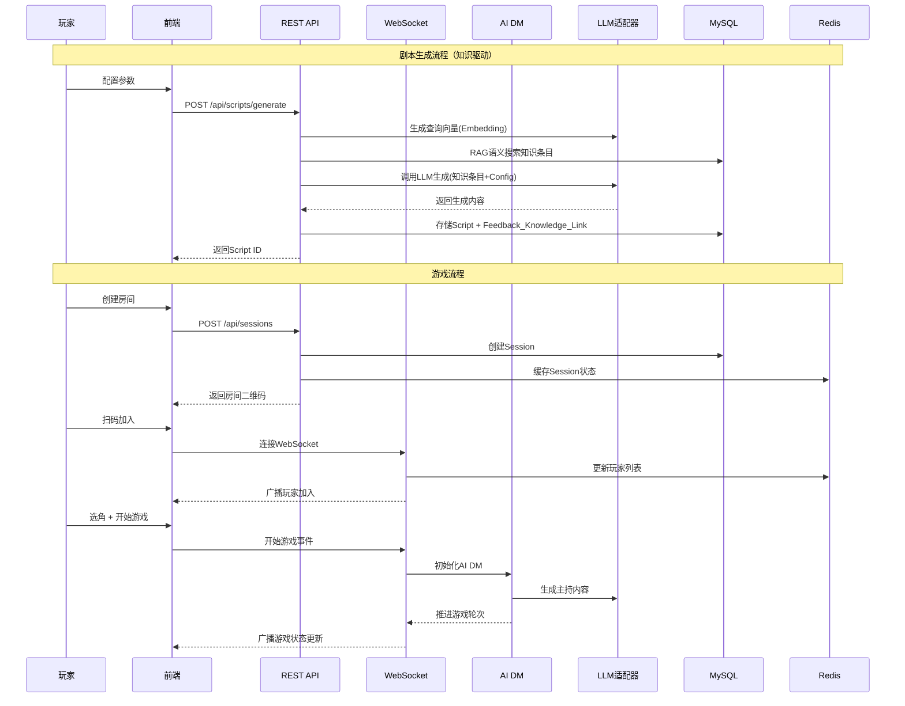
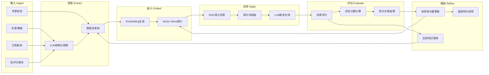

# 设计文档：线上剧本杀AI生成工具

## 概述

本系统是一个全栈TypeScript应用，由三个核心子系统组成：**剧本生成子系统**、**线上游玩子系统**和**知识库子系统**，通过评价反馈闭环连接。

系统采用前后端分离架构：
- **前端**：Vue 3 + TypeScript SPA，使用Vue Router路由管理，Pinia状态管理，Vue I18n国际化
- **后端**：Node.js + Express + TypeScript RESTful API + WebSocket实时通信
- **数据层**：MySQL持久化存储 + Redis缓存/会话/实时状态
- **AI层**：LLM适配器统一接入多种大语言模型，Embedding适配器生成向量嵌入，TTS引擎语音合成，可选视频生成
- **知识层**：向量存储（hnswlib）支持语义搜索，RAG检索增强生成，反馈驱动权重更新
- **部署**：Docker + Docker Compose容器编排，GitHub Actions CI/CD

核心设计决策：
1. **剧本与游戏解耦**：剧本作为独立资产存储在Script_Repository中，可被多个Game_Session复用
2. **AI DM全自动主持**：所有游戏由AI_DM主持，基于DM_Handbook自动推进流程
3. **分支叙事引擎**：支持多分支剧情和多结局，通过玩家投票动态选择路径
4. **知识驱动生成**：通过RAG从知识库中检索语义相关的知识条目，注入LLM提示词上下文，提升生成质量
5. **闭环学习系统**：学习→实践→反馈→精进，知识库通过玩家反馈持续演化，每个部署实例独立适应其玩家群体
6. **反馈驱动优化**：玩家评价和建议自动反馈到知识库和生成引擎，持续优化知识权重和剧本质量
7. **AI预生成访谈**：在剧本生成前通过自适应交互式访谈收集创作者意图，访谈模板本身也是知识库条目，通过反馈持续优化
8. **完整AI工具链**：提示词模板版本化管理、少样本示例管理、推理链模式、Token用量追踪、模型A/B测试，全面拥抱现代LLM工程实践
9. **玩家评价权重**：基于玩家游玩记录的加权评价机制，资深玩家的评价在反馈计算和排行榜中占更大权重
10. **双身份系统**：每个用户同时拥有玩家身份和设计师身份，两者独立升级，鼓励玩家向设计师过渡
11. **技能牌系统**：Skill模板以可选牌的形式呈现，设计师通过选牌定制生成效果，牌有等级和点数消耗，设计师等级决定可用点数预算
12. **双币经济系统**：游戏币（游玩奖励）和真实货币（充值支付LLM费用）完全分离，确保LLM成本由真实货币覆盖
13. **设计师荣誉系统**：设计师拥有专属排行榜和荣誉称号，激励持续创作高质量剧本

## 架构

### 系统架构图

```mermaid
graph TB
    subgraph Frontend["前端 (Vue 3 + TypeScript)"]
        UI[用户界面]
        Router[Vue Router]
        Store[Pinia Store]
        I18n[Vue I18n]
        WS_Client[WebSocket Client]
    end

    subgraph Backend["后端 (Node.js + Express)"]
        API[REST API Layer]
        WS_Server[WebSocket Server]
        AuthService[认证服务]
        
        subgraph Generation["剧本生成子系统"]
            ConfigService[配置服务]
            SkillService[Skill库服务]
            GeneratorService[生成引擎服务]
            FeedbackService[反馈服务]
            InterviewService[访谈服务]
        end

        subgraph KnowledgeSystem["知识库子系统"]
            KnowledgeBaseService[知识库服务]
            RAGService[RAG检索服务]
            EmbeddingAdapter[Embedding适配器]
            LearningPipeline[学习管道]
            KnowledgeImporter[知识导入器]
            VectorStore[向量存储 hnswlib]
        end

        subgraph AIToolchain["AI工具链"]
            PromptTemplateService[提示词模板服务]
            FewShotExampleService[少样本示例服务]
            ReasoningChainService[推理链服务]
            TokenTrackingService[Token追踪服务]
            ABTestService[A/B测试服务]
            PlayerRatingWeightService[玩家评价权重服务]
        end

        subgraph DesignerSystem["设计师与经济系统"]
            SkillCardService[技能牌服务]
            DesignerService[设计师服务]
            EconomyService[经济服务]
            DesignerLeaderboardService[设计师排行榜服务]
        end
        
        subgraph GamePlay["线上游玩子系统"]
            SessionService[会话管理服务]
            AIDMService[AI DM服务]
            ChatService[聊天服务]
            VoteService[投票服务]
        end
        
        subgraph Support["支撑服务"]
            LLMAdapter[LLM适配器]
            TTSEngine[TTS引擎]
            VideoGenerator[视频生成器]
            LeaderboardService[排行榜服务]
            AccountService[账户服务]
            AchievementService[成就服务]
            CollectionService[收藏服务]
        end
    end

    subgraph Data["数据层"]
        MySQL[(MySQL)]
        Redis[(Redis)]
    end

    UI --> Router
    UI --> Store
    UI --> I18n
    Store --> API
    WS_Client --> WS_Server
    
    API --> AuthService
    API --> ConfigService
    API --> GeneratorService
    API --> SessionService
    API --> FeedbackService
    API --> LeaderboardService
    API --> AccountService
    API --> KnowledgeBaseService
    API --> InterviewService
    API --> PromptTemplateService
    API --> ABTestService
    API --> TokenTrackingService
    API --> SkillCardService
    API --> DesignerService
    API --> EconomyService
    API --> DesignerLeaderboardService
    
    WS_Server --> AIDMService
    WS_Server --> ChatService
    WS_Server --> VoteService
    
    InterviewService --> LLMAdapter
    InterviewService --> RAGService
    GeneratorService --> PromptTemplateService
    GeneratorService --> FewShotExampleService
    GeneratorService --> ReasoningChainService
    GeneratorService --> ABTestService
    GeneratorService --> TokenTrackingService
    FeedbackService --> PlayerRatingWeightService
    LeaderboardService --> PlayerRatingWeightService
    LearningPipeline --> PlayerRatingWeightService
    LLMAdapter --> TokenTrackingService
    GeneratorService --> SkillService
    GeneratorService --> SkillCardService
    GeneratorService --> EconomyService
    GeneratorService --> LLMAdapter
    GeneratorService --> FeedbackService
    GeneratorService --> RAGService
    RAGService --> VectorStore
    RAGService --> EmbeddingAdapter
    KnowledgeBaseService --> VectorStore
    KnowledgeBaseService --> EmbeddingAdapter
    KnowledgeImporter --> LLMAdapter
    KnowledgeImporter --> KnowledgeBaseService
    LearningPipeline --> FeedbackService
    LearningPipeline --> KnowledgeBaseService
    LearningPipeline --> LLMAdapter
    AIDMService --> LLMAdapter
    AIDMService --> TTSEngine
    GeneratorService --> VideoGenerator
    
    AuthService --> MySQL
    AuthService --> Redis
    ConfigService --> MySQL
    GeneratorService --> MySQL
    SessionService --> MySQL
    SessionService --> Redis
    FeedbackService --> MySQL
    LeaderboardService --> MySQL
    LeaderboardService --> Redis
    AccountService --> MySQL
    AchievementService --> MySQL
    CollectionService --> MySQL
    ChatService --> Redis
    KnowledgeBaseService --> MySQL
    SkillCardService --> MySQL
    DesignerService --> MySQL
    EconomyService --> MySQL
    DesignerLeaderboardService --> MySQL
    DesignerLeaderboardService --> Redis
```



### 请求流程



### 知识库学习闭环流程




## 组件与接口

### 1. 配置服务 (ConfigService)

负责剧本生成参数的校验、轮次结构自动适配和配置对象管理。

```typescript
// 游戏类型枚举
enum GameType {
  HONKAKU = 'honkaku',       // 本格
  SHIN_HONKAKU = 'shin_honkaku', // 新本格
  HENKAKU = 'henkaku'        // 变格
}

// 目标年龄段枚举
enum AgeGroup {
  ELEMENTARY = 'elementary',   // 小学生
  MIDDLE_SCHOOL = 'middle_school', // 中学生
  COLLEGE = 'college',         // 大学生
  ADULT = 'adult'              // 成年人
}

// 轮次阶段
interface RoundPhase {
  reading: number;    // 阅读时间（分钟）
  investigation: number; // 搜证时间（分钟）
  discussion: number;    // 推证/讨论时间（分钟）
}

// 轮次结构
interface RoundStructure {
  totalRounds: number;
  phases: RoundPhase[];
  finalVoteMinutes: number;
  revealMinutes: number;
}

// 配置参数
interface ScriptConfig {
  id: string;
  playerCount: number;        // 1-6
  durationHours: number;      // 2-6
  gameType: GameType;
  ageGroup: AgeGroup;
  restorationRatio: number;   // 还原比例 0-100
  deductionRatio: number;     // 推理比例 0-100, 与还原比例之和=100
  era: string;                // 时代背景
  location: string;           // 地点设定
  theme: string;              // 主题风格
  language: string;           // 生成语言
  roundStructure: RoundStructure; // 自动计算
}

// 配置服务接口
interface IConfigService {
  validate(input: CreateConfigInput): ValidationResult;
  create(input: CreateConfigInput): Promise<ScriptConfig>;
  calculateRoundStructure(durationHours: number): RoundStructure;
  getById(id: string): Promise<ScriptConfig | null>;
}

// 校验结果
interface ValidationResult {
  valid: boolean;
  errors: ValidationError[];
}

interface ValidationError {
  field: string;
  message: string;
  constraint: string;
}
```

**轮次自动适配规则**：
| 时长 | 轮次 | 每轮时间 | 总结时间 |
|------|------|----------|----------|
| 2小时 | 2轮 | ~50分钟 | 20分钟 |
| 3小时 | 3轮 | ~50分钟 | 30分钟 |
| 4小时 | 3-4轮 | ~50分钟 | 30分钟 |
| 5小时 | 4轮 | ~55分钟 | 40分钟 |
| 6小时 | 4-5轮 | ~55分钟 | 40分钟 |

### 2. Skill库服务 (SkillService)

管理预定义的剧本杀Skill模板，按游戏类型提供对应模板。

```typescript
// Skill类别
enum SkillCategory {
  CHARACTER_DESIGN = 'character_design',     // 角色设计
  CLUE_DESIGN = 'clue_design',              // 线索设计
  TIMELINE = 'timeline',                     // 时间线构建
  MOTIVE = 'motive',                         // 动机设计
  TRICK = 'trick',                           // 诡计设计
  RESTORATION = 'restoration',               // 还原逻辑
  DEDUCTION_CHAIN = 'deduction_chain'        // 推理链条
}

// Skill模板
interface SkillTemplate {
  id: string;
  category: SkillCategory;
  name: string;
  description: string;
  gameTypes: GameType[];       // 适用的游戏类型
  priority: number;            // 优先级（类型匹配时使用）
  content: string;             // 模板内容（Prompt片段）
}

interface ISkillService {
  getByCategory(category: SkillCategory): Promise<SkillTemplate[]>;
  getByGameType(gameType: GameType): Promise<SkillTemplate[]>;
  getForGeneration(gameType: GameType, categories: SkillCategory[]): Promise<SkillTemplate[]>;
  serialize(template: SkillTemplate): string;   // JSON序列化
  deserialize(json: string): SkillTemplate;     // JSON反序列化
}
```

### 3. 知识库服务 (KnowledgeBaseService)

知识库核心服务，管理知识条目的CRUD、向量嵌入和有效性分数更新。

```typescript
// 知识分类
enum KnowledgeCategory {
  TECHNIQUES = 'techniques',           // 设计技巧
  PATTERNS = 'patterns',               // 结构模式
  EXAMPLES = 'examples',               // 优秀案例
  ANTI_PATTERNS = 'anti_patterns',     // 反面教材
  PLAYER_PREFERENCES = 'player_preferences', // 玩家偏好
  PROMPT_TEMPLATES = 'prompt_templates',     // 提示词模板
  REASONING_CHAINS = 'reasoning_chains'      // 推理链模式
}

// 知识来源
enum KnowledgeSource {
  SEED = 'seed',                       // Skill种子导入
  MANUAL = 'manual',                   // 手动录入
  ARTICLE = 'article',                 // 文章提取
  SCRIPT_ANALYSIS = 'script_analysis', // 剧本分析
  FEEDBACK_EXTRACTION = 'feedback_extraction', // 反馈提炼
  HIGH_RATED_SCRIPT = 'high_rated_script'      // 高评分剧本提取
}

// 知识条目状态
enum KnowledgeStatus {
  ACTIVE = 'active',
  DEPRECATED = 'deprecated',
  EMBEDDING_PENDING = 'embedding_pending'
}

// 知识条目
interface KnowledgeEntry {
  id: string;
  content: string;
  category: KnowledgeCategory;
  gameTypeTags: GameType[];
  effectivenessScore: number;          // 0.0-1.0, 默认0.5
  source: KnowledgeSource;
  sourceReference: string;
  embedding: number[] | null;          // 向量嵌入
  usageCount: number;
  status: KnowledgeStatus;
  createdAt: Date;
  updatedAt: Date;
}

// 权重更新记录
interface WeightUpdateRecord {
  id: string;
  knowledgeEntryId: string;
  reason: 'feedback' | 'manual';
  feedbackId: string | null;
  previousScore: number;
  newScore: number;
  createdAt: Date;
}

// 知识快照
interface KnowledgeSnapshot {
  id: string;
  entries: KnowledgeEntry[];
  totalEntries: number;
  avgEffectivenessScore: number;
  trigger: 'manual' | 'pre_update' | 'rollback';
  createdAt: Date;
}

// 反馈-知识关联
interface FeedbackKnowledgeLink {
  scriptId: string;
  knowledgeEntryIds: string[];
  createdAt: Date;
}

// 知识库查询过滤器
interface KnowledgeFilter {
  categories?: KnowledgeCategory[];
  gameTypes?: GameType[];
  status?: KnowledgeStatus;
  minScore?: number;
  maxScore?: number;
  limit?: number;
  offset?: number;
}

// 知识库统计
interface KnowledgeStats {
  totalEntries: number;
  byCategory: Record<KnowledgeCategory, number>;
  byStatus: Record<KnowledgeStatus, number>;
  avgEffectivenessScore: number;
  scoreDistribution: { range: string; count: number }[];
}

interface IKnowledgeBaseService {
  // CRUD
  create(input: CreateKnowledgeInput): Promise<KnowledgeEntry>;
  getById(id: string): Promise<KnowledgeEntry | null>;
  update(id: string, input: UpdateKnowledgeInput): Promise<KnowledgeEntry>;
  deprecate(id: string): Promise<void>;
  query(filter: KnowledgeFilter): Promise<{ entries: KnowledgeEntry[]; total: number }>;

  // 有效性分数
  updateEffectivenessScore(id: string, delta: number, reason: 'feedback' | 'manual', feedbackId?: string): Promise<void>;
  getWeightHistory(id: string, limit: number): Promise<WeightUpdateRecord[]>;

  // 快照
  createSnapshot(trigger: 'manual' | 'pre_update'): Promise<KnowledgeSnapshot>;
  listSnapshots(): Promise<KnowledgeSnapshot[]>;
  rollbackToSnapshot(snapshotId: string): Promise<void>;

  // 导出/导入
  exportKnowledgeBase(): Promise<string>;  // JSON
  importKnowledgeBase(json: string): Promise<{ imported: number; skipped: number }>;

  // 统计
  getStats(): Promise<KnowledgeStats>;

  // 种子数据
  seedFromSkills(skills: SkillTemplate[]): Promise<number>;

  // 序列化
  serialize(entry: KnowledgeEntry): string;
  deserialize(json: string): KnowledgeEntry;
}
```

### 4. Embedding适配器 (EmbeddingAdapter)

向量嵌入生成的适配层，支持多种嵌入模型提供商。

```typescript
interface EmbeddingRequest {
  text: string;
  model?: string;
}

interface EmbeddingResponse {
  embedding: number[];
  dimensions: number;
  model: string;
  tokenUsage: number;
}

interface IEmbeddingAdapter {
  embed(request: EmbeddingRequest): Promise<EmbeddingResponse>;
  embedBatch(requests: EmbeddingRequest[]): Promise<EmbeddingResponse[]>;
  getProviderName(): string;
  getDimensions(): number;
}

// 配置通过环境变量
// EMBEDDING_PROVIDER=openai|local
// EMBEDDING_API_KEY=xxx
// EMBEDDING_ENDPOINT=https://api.openai.com/v1/embeddings
// EMBEDDING_MODEL=text-embedding-3-small
```

### 5. 向量存储 (VectorStore)

进程内向量存储，使用hnswlib实现近似最近邻搜索。

```typescript
interface VectorSearchResult {
  id: string;
  score: number;  // 余弦相似度 0-1
}

interface IVectorStore {
  initialize(dimensions: number): Promise<void>;
  addVector(id: string, vector: number[]): Promise<void>;
  removeVector(id: string): Promise<void>;
  search(queryVector: number[], topK: number): Promise<VectorSearchResult[]>;
  size(): number;
  save(path: string): Promise<void>;
  load(path: string): Promise<void>;
}
```

### 6. RAG检索服务 (RAGService)

检索增强生成服务，负责从知识库中检索语义相关的知识条目并组装到LLM提示词中。

```typescript
interface RAGQuery {
  gameType: GameType;
  theme: string;
  era: string;
  location: string;
  categories?: KnowledgeCategory[];
}

interface RAGResult {
  entries: KnowledgeEntry[];
  queryEmbedding: number[];
  totalCandidates: number;
}

interface IRAGService {
  retrieve(query: RAGQuery, topK?: number): Promise<RAGResult>;
  buildPromptContext(entries: KnowledgeEntry[], maxTokens?: number): string;
  semanticSearch(text: string, topK?: number): Promise<KnowledgeEntry[]>;
}

// 默认配置
const RAG_CONFIG = {
  defaultTopK: 20,
  maxContextTokens: 4000,       // 知识条目占用的最大token数
  minEffectivenessScore: 0.2    // 最低有效性分数阈值
};
```

### 7. 学习管道 (LearningPipeline)

闭环学习流程的编排服务，协调反馈分析、权重更新和知识提炼。

```typescript
interface FeedbackAnalysisResult {
  scriptId: string;
  compositeScore: number;        // 综合反馈分数
  linkedEntryIds: string[];
  weightAdjustments: { entryId: string; delta: number }[];
  autoDeprecated: string[];      // 自动弃用的条目ID
}

interface KnowledgeExtractionResult {
  candidates: {
    content: string;
    suggestedCategory: KnowledgeCategory;
    source: KnowledgeSource;
    sourceReference: string;
  }[];
}

interface ILearningPipeline {
  // 反馈处理
  processFeedback(feedbackId: string): Promise<FeedbackAnalysisResult>;
  calculateCompositeScore(feedback: Feedback): number;

  // 知识提炼
  extractFromFeedbacks(scriptId: string): Promise<KnowledgeExtractionResult>;
  extractFromHighRatedScript(scriptId: string): Promise<KnowledgeExtractionResult>;
  extractFromArticle(text: string): Promise<KnowledgeExtractionResult>;
  extractFromScript(scriptContent: string): Promise<KnowledgeExtractionResult>;

  // 自动触发检查
  checkFeedbackExtractionTrigger(scriptId: string): Promise<boolean>;
  checkHighRatedScriptTrigger(scriptId: string): Promise<boolean>;
}

// 综合分数计算权重
const COMPOSITE_SCORE_WEIGHTS = {
  plotScore: 0.3,
  difficultyScore: 0.2,
  characterScore: 0.3,
  overallScore: 0.2
};

// 有效性分数调整参数
const EFFECTIVENESS_ADJUSTMENT = {
  positiveThreshold: 7,          // 高于此分数增加权重
  negativeThreshold: 5,          // 低于此分数减少权重
  positiveDeltaFactor: 0.02,
  negativeDeltaFactor: 0.02,
  autoDeprecateThreshold: 0.1,   // 低于此分数考虑弃用
  autoDeprecateConsecutive: 5    // 连续负向调整次数
};
```

### 8. 生成引擎服务 (GeneratorService)

核心AI生成模块，调用LLM结合知识库生成完整剧本。

```typescript
// 剧本结构
interface Script {
  id: string;
  version: string;            // 版本号 如 "v1.0"
  configId: string;
  config: ScriptConfig;
  dmHandbook: DMHandbook;
  playerHandbooks: PlayerHandbook[];
  materials: Material[];
  branchStructure: BranchStructure;
  videoMarkers: VideoMarker[];  // 可生成视频的关键节点
  createdAt: Date;
  updatedAt: Date;
}

// 分支结构
interface BranchStructure {
  nodes: BranchNode[];
  edges: BranchEdge[];
  endings: Ending[];
}

interface BranchNode {
  id: string;
  roundIndex: number;
  description: string;
  voteQuestion: string;
  options: VoteOption[];
}

interface VoteOption {
  id: string;
  text: string;
  nextNodeId: string | null;   // null表示进入结局
  endingId: string | null;
}

interface Ending {
  id: string;
  name: string;
  triggerConditions: TriggerCondition[];
  narrative: string;
  playerEndings: PlayerEnding[];
}

interface PlayerEnding {
  characterId: string;
  narrative: string;
  outcome: string;
}

// 生成引擎接口
interface IGeneratorService {
  generate(config: ScriptConfig): Promise<Script>;
  optimizeWithFeedback(scriptId: string, feedback: AggregatedFeedback): Promise<Script>;
  getScript(id: string): Promise<Script | null>;
  getScriptVersions(id: string): Promise<Script[]>;
  listScripts(filters?: ScriptFilters): Promise<Script[]>;
  serializeScript(script: Script): string;
  deserializeScript(json: string): Script;
  getUsedKnowledge(scriptId: string): Promise<FeedbackKnowledgeLink | null>;
}
```

### 9. DM手册 (DMHandbook)

```typescript
interface DMHandbook {
  overview: string;
  characters: CharacterSummary[];
  timeline: TimelineEvent[];
  clueDistribution: ClueDistributionEntry[];
  roundGuides: RoundGuide[];
  branchDecisionPoints: BranchDecisionPoint[];
  endings: EndingDescription[];
  truthReveal: string;
  judgingRules: JudgingRules;
}

interface TimelineEvent {
  time: string;
  event: string;
  involvedCharacters: string[];
  isPublic: boolean;
}

interface ClueDistributionEntry {
  clueId: string;
  roundIndex: number;
  targetCharacterId: string;
  condition: string;
  timing: string;
}

interface BranchDecisionPoint {
  roundIndex: number;
  voteQuestion: string;
  options: { text: string; consequence: string }[];
}

interface JudgingRules {
  winConditions: string[];
  scoringCriteria: ScoringCriterion[];
}
```

### 10. 玩家手册 (PlayerHandbook)

```typescript
interface PlayerHandbook {
  characterId: string;
  characterName: string;
  backgroundStory: string;
  primaryGoal: string;
  secondaryGoals: string[];
  relationships: CharacterRelationship[];
  knownClues: string[];
  roundActions: RoundAction[];
  secrets: string[];           // 仅该角色可见
}

interface CharacterRelationship {
  targetCharacterId: string;
  targetName: string;
  relationship: string;
  knownFacts: string[];
}

interface RoundAction {
  roundIndex: number;
  readingGuide: string;
  investigationGuide: string;
  discussionGuide: string;
}
```

### 11. 游戏物料 (Material)

```typescript
enum MaterialType {
  CLUE_CARD = 'clue_card',
  PROP_CARD = 'prop_card',
  VOTE_CARD = 'vote_card',
  SCENE_CARD = 'scene_card'
}

interface Material {
  id: string;
  type: MaterialType;
  content: string;
  associatedCharacterId?: string;
  metadata: Record<string, unknown>;
}

interface ClueCard extends Material {
  type: MaterialType.CLUE_CARD;
  clueId: string;              // 与DM手册线索分发表对应
  associatedCharacterId: string;
}
```

### 12. 游戏会话服务 (SessionService)

```typescript
enum SessionStatus {
  WAITING = 'waiting',         // 等待玩家加入
  SELECTING = 'selecting',     // 选角阶段
  PLAYING = 'playing',         // 游戏进行中
  VOTING = 'voting',           // 投票中
  ENDED = 'ended'              // 已结束
}

interface GameSession {
  id: string;
  scriptId: string;
  status: SessionStatus;
  qrCodeUrl: string;
  players: SessionPlayer[];
  currentRound: number;
  currentPhase: string;
  voteHistory: VoteRecord[];
  branchPath: string[];        // 已走过的分支节点ID
  endingId: string | null;
  createdAt: Date;
}

interface SessionPlayer {
  userId: string;
  characterId: string | null;
  isReady: boolean;
  joinedAt: Date;
}

interface ISessionService {
  create(scriptId: string, creatorUserId: string): Promise<GameSession>;
  join(sessionId: string, userId: string): Promise<GameSession>;
  selectCharacter(sessionId: string, userId: string, characterId: string): Promise<void>;
  startGame(sessionId: string): Promise<void>;
  getSession(id: string): Promise<GameSession | null>;
  generateQRCode(sessionId: string): Promise<string>;
}
```

### 13. AI DM服务 (AIDMService)

```typescript
interface IAIDMService {
  initialize(session: GameSession, handbook: DMHandbook): Promise<void>;
  advanceRound(sessionId: string): Promise<RoundUpdate>;
  distributeClues(sessionId: string, roundIndex: number): Promise<ClueDistribution[]>;
  initiateVote(sessionId: string, branchPoint: BranchDecisionPoint): Promise<void>;
  processVoteResult(sessionId: string, voteResult: VoteResult): Promise<BranchOutcome>;
  answerQuestion(sessionId: string, question: string, askerId: string): Promise<string>;
  generatePlayerEvaluation(sessionId: string, userId: string): Promise<PlayerEvaluation>;
  speakText(text: string): Promise<AudioBuffer | null>; // TTS，失败返回null
}

interface PlayerEvaluation {
  userId: string;
  deductionScore: number;      // 推理表现评分 1-10
  roleplayScore: number;       // 角色扮演评分 1-10
  keyDecisions: string[];      // 关键决策回顾
  summary: string;
}

interface RoundUpdate {
  roundIndex: number;
  phase: string;
  narrative: string;
  distributedClues: ClueDistribution[];
}
```

### 14. LLM适配器 (LLMAdapter)

```typescript
interface LLMRequest {
  prompt: string;
  systemPrompt?: string;
  maxTokens?: number;
  temperature?: number;
}

interface LLMResponse {
  content: string;
  tokenUsage: { prompt: number; completion: number; total: number };
  responseTimeMs: number;
}

interface ILLMAdapter {
  send(request: LLMRequest): Promise<LLMResponse>;
  getProviderName(): string;
}

// 重试配置
const LLM_RETRY_CONFIG = {
  maxRetries: 3,
  baseDelayMs: 1000,
  backoffMultiplier: 2
};
```

### 15. 反馈服务 (FeedbackService)

```typescript
interface Feedback {
  id: string;
  sessionId: string;
  scriptId: string;
  userId: string;
  plotScore: number;           // 剧情评分 1-10
  difficultyScore: number;     // 推理难度评分 1-10
  characterScore: number;      // 角色体验评分 1-10
  overallScore: number;        // 整体满意度 1-10
  comment: string;
  createdAt: Date;
}

interface LiveSuggestion {
  id: string;
  sessionId: string;
  scriptId: string;
  userId: string;
  content: string;
  createdAt: Date;
}

interface AggregatedFeedback {
  scriptId: string;
  totalFeedbacks: number;
  avgPlotScore: number;
  avgDifficultyScore: number;
  avgCharacterScore: number;
  avgOverallScore: number;
  lowScoreDimensions: string[];  // 平均分<6的维度
  topSuggestions: string[];
}

interface IFeedbackService {
  submitFeedback(input: CreateFeedbackInput): Promise<Feedback>;
  submitLiveSuggestion(input: CreateSuggestionInput): Promise<LiveSuggestion>;
  getAggregatedFeedback(scriptId: string): Promise<AggregatedFeedback>;
  checkAutoOptimizeTrigger(scriptId: string): Promise<boolean>;
  triggerAutoOptimize(scriptId: string): Promise<Script>;
}
```

### 16. 账户服务 (AccountService)

```typescript
interface PlayerAccount {
  id: string;
  email: string;
  passwordHash: string;
  nickname: string;
  avatarUrl: string;
  // 玩家身份
  playerLevel: number;
  playerXp: number;
  totalGamesPlayed: number;
  totalScriptsPlayed: number;
  totalEndingsUnlocked: number;
  // 经济
  gameCoinBalance: number;
  realCurrencyBalance: number;
  createdAt: Date;
}

interface IAccountService {
  register(email: string, password: string, nickname: string): Promise<PlayerAccount>;
  login(email: string, password: string): Promise<{ token: string; account: PlayerAccount }>;
  getProfile(userId: string): Promise<PlayerAccount>;
  updateProfile(userId: string, updates: Partial<Pick<PlayerAccount, 'nickname' | 'avatarUrl'>>): Promise<void>;
  getGameHistory(userId: string): Promise<GameHistoryEntry[]>;
  getDualIdentityProfile(userId: string): Promise<DualIdentityProfile>;
}
```

### 17. 成就与收藏服务

```typescript
interface Achievement {
  id: string;
  name: string;
  description: string;
  requiredGames: number | null;  // 基于游玩次数的成就
  specialCondition: string | null; // 特殊条件成就
  iconUrl: string;
}

interface CollectionItem {
  id: string;
  userId: string;
  type: 'ending_card' | 'character_card';
  scriptId: string;
  itemName: string;
  unlockedAt: Date;
}

interface IAchievementService {
  checkAndUnlock(userId: string): Promise<Achievement[]>;
  getUnlocked(userId: string): Promise<Achievement[]>;
  getAllAchievements(): Promise<Achievement[]>;
}

interface ICollectionService {
  unlockItems(userId: string, sessionId: string): Promise<CollectionItem[]>;
  getCollection(userId: string): Promise<CollectionItem[]>;
  getScriptProgress(userId: string, scriptId: string): Promise<ScriptCollectionProgress>;
}
```

### 18. 排行榜服务 (LeaderboardService)

```typescript
interface LeaderboardEntry {
  scriptId: string;
  scriptName: string;
  gameType: GameType;
  playerCount: number;
  avgScore: number;
  totalPlays: number;
  status: 'ranked' | 'pending'; // pending = 游玩次数<3
}

interface ILeaderboardService {
  getRankings(limit: number, offset: number): Promise<LeaderboardEntry[]>;
  recalculate(scriptId: string): Promise<void>;
}
```

### 19. WebSocket事件协议

```typescript
// 客户端 -> 服务端
type ClientEvent =
  | { type: 'join_session'; sessionId: string; token: string }
  | { type: 'select_character'; characterId: string }
  | { type: 'ready' }
  | { type: 'chat_message'; content: string }
  | { type: 'vote'; optionId: string }
  | { type: 'ask_dm'; question: string }
  | { type: 'submit_suggestion'; content: string };

// 服务端 -> 客户端
type ServerEvent =
  | { type: 'player_joined'; player: SessionPlayer }
  | { type: 'player_left'; userId: string }
  | { type: 'character_selected'; userId: string; characterId: string }
  | { type: 'game_started' }
  | { type: 'round_update'; round: RoundUpdate }
  | { type: 'clue_received'; clue: ClueCard }
  | { type: 'chat_message'; userId: string; content: string; timestamp: Date }
  | { type: 'vote_initiated'; question: string; options: VoteOption[] }
  | { type: 'vote_result'; result: VoteResult }
  | { type: 'branch_outcome'; narrative: string }
  | { type: 'dm_speech'; text: string; audioUrl?: string }
  | { type: 'game_ended'; ending: Ending; evaluations: PlayerEvaluation[] }
  | { type: 'video_play'; videoUrl: string }
  | { type: 'error'; message: string };
```

### 20. REST API端点

```
认证:
  POST   /api/auth/register          - 注册
  POST   /api/auth/login             - 登录

账户:
  GET    /api/account/profile        - 获取个人信息
  PUT    /api/account/profile        - 更新个人信息
  GET    /api/account/history        - 游戏历史
  GET    /api/account/achievements   - 成就列表
  GET    /api/account/collection     - 收藏列表

配置:
  POST   /api/configs                - 创建配置
  GET    /api/configs/:id            - 获取配置

剧本:
  POST   /api/scripts/generate       - 生成剧本
  GET    /api/scripts                - 剧本列表
  GET    /api/scripts/:id            - 获取剧本详情
  GET    /api/scripts/:id/versions   - 获取版本历史
  POST   /api/scripts/:id/optimize   - 手动触发优化

游戏会话:
  POST   /api/sessions               - 创建会话
  GET    /api/sessions/:id           - 获取会话信息
  GET    /api/sessions/:id/qrcode    - 获取二维码

反馈:
  POST   /api/feedback               - 提交评价
  GET    /api/feedback/script/:id    - 获取剧本评价汇总

排行榜:
  GET    /api/leaderboard            - 获取排行榜

知识库:
  GET    /api/knowledge              - 知识条目列表（支持分页、筛选、排序）
  POST   /api/knowledge              - 创建知识条目
  GET    /api/knowledge/:id          - 获取知识条目详情
  PUT    /api/knowledge/:id          - 更新知识条目
  DELETE /api/knowledge/:id          - 弃用知识条目
  GET    /api/knowledge/:id/history  - 获取权重更新历史
  POST   /api/knowledge/search       - 语义搜索（输入文本返回相似条目）
  POST   /api/knowledge/import/article   - 从文章提取知识
  POST   /api/knowledge/import/script    - 从剧本分析提取知识
  POST   /api/knowledge/import/confirm   - 确认导入候选知识
  GET    /api/knowledge/stats        - 知识库统计数据
  POST   /api/knowledge/snapshots    - 创建快照
  GET    /api/knowledge/snapshots    - 快照列表
  POST   /api/knowledge/snapshots/:id/rollback - 回滚到快照
  GET    /api/knowledge/export       - 导出知识库JSON
  POST   /api/knowledge/import       - 导入知识库JSON

国际化:
  GET    /api/i18n/:locale           - 获取语言包
```


### 21. 插件系统 (PluginSystem)

可扩展的插件架构，支持通过配置文件注册不同类型的AI生成服务和云存储服务。

```typescript
// 插件类型
enum PluginType {
  STORAGE = 'storage',         // 存储插件（本地/腾讯COS/AWS S3）
  IMAGE_GEN = 'image_gen',     // 图片生成插件
  MUSIC_GEN = 'music_gen',     // 音乐生成插件
  VIDEO_GEN = 'video_gen',     // 视频生成插件
  TTS_GEN = 'tts_gen'          // TTS语音插件
}

// 插件基础接口
interface IPlugin {
  name: string;
  type: PluginType;
  version: string;
  initialize(config: Record<string, unknown>): Promise<void>;
  destroy(): Promise<void>;
  isHealthy(): Promise<boolean>;
}

// 插件注册表配置（plugins.json）
interface PluginConfig {
  plugins: {
    name: string;
    type: PluginType;
    enabled: boolean;
    module: string;            // 模块路径
    config: Record<string, unknown>;
  }[];
}

// 插件管理器
interface IPluginManager {
  loadPlugins(config: PluginConfig): Promise<void>;
  getPlugin<T extends IPlugin>(type: PluginType): T | null;
  getEnabledPlugins(): IPlugin[];
  isPluginEnabled(type: PluginType): boolean;
}
```

### 22. 资源存储服务 (AssetStorage)

统一的资源存取抽象层，默认本地存储，可通过插件切换到云存储。

```typescript
// 资源类型
enum AssetType {
  IMAGE = 'image',
  VIDEO = 'video',
  AUDIO = 'audio',             // 音乐/音效
  TTS_AUDIO = 'tts_audio'      // TTS语音文件
}

// 资源元数据
interface Asset {
  id: string;
  scriptId: string;
  type: AssetType;
  filename: string;
  url: string;                 // 访问URL（本地路径或CDN地址）
  size: number;
  mimeType: string;
  metadata: Record<string, unknown>; // 关联的剧情节点ID等
  createdAt: Date;
}

// 存储插件接口
interface IStoragePlugin extends IPlugin {
  type: PluginType.STORAGE;
  upload(file: Buffer, filename: string, mimeType: string): Promise<string>; // 返回URL
  download(url: string): Promise<Buffer>;
  delete(url: string): Promise<void>;
  getPublicUrl(filename: string): string;
}

// 资源存储服务
interface IAssetStorageService {
  store(scriptId: string, type: AssetType, file: Buffer, filename: string, metadata?: Record<string, unknown>): Promise<Asset>;
  get(assetId: string): Promise<Asset | null>;
  getByScript(scriptId: string, type?: AssetType): Promise<Asset[]>;
  delete(assetId: string): Promise<void>;
}
```

**存储插件实现**：
- `LocalStoragePlugin`：默认，存储到本地 `./uploads/` 目录
- `TencentCOSPlugin`：腾讯云COS，配置 SecretId/SecretKey/Bucket/Region
- 可扩展 AWS S3、阿里云 OSS 等

### 23. 标签系统 (TagSystem)

```typescript
// 标签
interface Tag {
  id: string;
  name: string;
  category: TagCategory;       // 标签分类
}

enum TagCategory {
  GAME_TYPE = 'game_type',     // 游戏类型：本格/新本格/变格
  AGE_GROUP = 'age_group',     // 年龄段
  PLAYER_COUNT = 'player_count', // 玩家人数
  ERA = 'era',                 // 时代背景
  THEME = 'theme',             // 主题风格
  CUSTOM = 'custom'            // 用户自定义
}

// 剧本-标签关联
interface ScriptTag {
  scriptId: string;
  tagId: string;
  isAutoGenerated: boolean;    // 系统自动生成 vs 用户手动添加
}

interface ITagService {
  autoGenerateTags(script: Script): Promise<Tag[]>;
  addCustomTag(scriptId: string, tagName: string): Promise<Tag>;
  removeTag(scriptId: string, tagId: string): Promise<void>;
  getScriptTags(scriptId: string): Promise<Tag[]>;
  searchByTags(tagIds: string[], limit: number, offset: number): Promise<Script[]>;
  getPopularTags(limit: number): Promise<Tag[]>;
}
```

**REST API 补充**：
```
标签:
  GET    /api/tags                   - 获取所有标签（支持按category筛选）
  GET    /api/tags/popular           - 热门标签
  POST   /api/scripts/:id/tags      - 为剧本添加自定义标签
  DELETE /api/scripts/:id/tags/:tagId - 移除标签

剧本搜索:
  GET    /api/scripts/search?tags=tag1,tag2&gameType=honkaku&ageGroup=adult
```

### 24. AI预生成访谈服务 (InterviewService)

在剧本生成前，AI与创作者进行交互式访谈，通过自适应问答收集创作意图。

```typescript
// 访谈会话
interface InterviewSession {
  id: string;
  configId: string;
  qaHistory: InterviewQA[];
  summary: string | null;
  summaryConfirmed: boolean;
  status: 'in_progress' | 'summarizing' | 'confirmed' | 'cancelled';
  templateId: string | null;       // 使用的访谈模板知识条目ID
  createdAt: Date;
  updatedAt: Date;
}

// 访谈问答对
interface InterviewQA {
  questionIndex: number;
  question: string;
  answer: string;
  dimension: InterviewDimension;   // 该问题覆盖的维度
  answeredAt: Date;
}

// 访谈核心维度
enum InterviewDimension {
  NARRATIVE_STYLE = 'narrative_style',       // 叙事风格偏好
  EMOTIONAL_TONE = 'emotional_tone',         // 情感基调
  DEDUCTION_COMPLEXITY = 'deduction_complexity', // 推理复杂度期望
  CHARACTER_DEPTH = 'character_depth',       // 角色关系深度
  INTERACTION_MODE = 'interaction_mode',     // 玩家互动模式
  SPECIAL_MECHANICS = 'special_mechanics'    // 特殊机制需求
}

// 访谈模板（作为Knowledge_Entry存储）
interface InterviewTemplateContent {
  initialQuestion: string;
  coreDimensions: InterviewDimension[];
  maxQuestions: number;            // 默认10
  summaryPrompt: string;          // 生成摘要的提示词
  fallbackQuestions: string[];     // LLM失败时的备选问题
}

// 访谈服务接口
interface IInterviewService {
  startInterview(configId: string): Promise<InterviewSession>;
  submitAnswer(sessionId: string, answer: string): Promise<{ nextQuestion: string | null; isComplete: boolean }>;
  generateSummary(sessionId: string): Promise<string>;
  confirmSummary(sessionId: string, modifiedSummary?: string): Promise<InterviewSession>;
  cancelInterview(sessionId: string): Promise<void>;
  getSession(sessionId: string): Promise<InterviewSession | null>;
}

// 访谈配置
const INTERVIEW_CONFIG = {
  maxQuestions: 10,
  defaultDimensions: Object.values(InterviewDimension),
  summaryMaxTokens: 1000
};
```

### 25. 提示词模板管理服务 (PromptTemplateService)

可版本化管理的LLM提示词模板系统，支持变量插值、版本控制和A/B测试。

```typescript
// 提示词模板类别
enum PromptCategory {
  SCRIPT_GENERATION = 'script_generation',       // 剧本生成主模板
  CHARACTER_GENERATION = 'character_generation',  // 角色生成模板
  CLUE_GENERATION = 'clue_generation',           // 线索生成模板
  BRANCH_GENERATION = 'branch_generation',       // 分支结构生成模板
  INTERVIEW_QUESTION = 'interview_question',     // 访谈问题生成模板
  KNOWLEDGE_EXTRACTION = 'knowledge_extraction', // 知识提炼模板
  FEEDBACK_ANALYSIS = 'feedback_analysis'        // 反馈分析模板
}

// 提示词模板
interface PromptTemplate {
  id: string;
  name: string;
  category: PromptCategory;
  currentVersion: number;
  activeVersionId: string;
  variables: PromptVariable[];     // 模板变量定义
  createdAt: Date;
  updatedAt: Date;
}

// 模板变量定义
interface PromptVariable {
  name: string;                    // 变量名，如 "playerCount"
  required: boolean;
  defaultValue: string | null;
  description: string;
}

// 提示词版本
interface PromptVersion {
  id: string;
  templateId: string;
  version: number;
  content: string;                 // 模板内容，含 {{variable}} 占位符
  changelog: string;
  createdAt: Date;
}

// 渲染结果
interface PromptRenderResult {
  renderedContent: string;
  usedVariables: Record<string, string>;
  missingRequired: string[];
}

interface IPromptTemplateService {
  // CRUD
  create(input: CreatePromptTemplateInput): Promise<PromptTemplate>;
  getById(id: string): Promise<PromptTemplate | null>;
  getByCategory(category: PromptCategory): Promise<PromptTemplate[]>;
  
  // 版本管理
  updateContent(templateId: string, content: string, changelog: string): Promise<PromptVersion>;
  getVersionHistory(templateId: string): Promise<PromptVersion[]>;
  rollbackToVersion(templateId: string, versionId: string): Promise<PromptTemplate>;
  getActiveVersion(templateId: string): Promise<PromptVersion>;
  
  // 渲染
  render(templateId: string, variables: Record<string, string>): Promise<PromptRenderResult>;
  
  // 序列化
  serialize(template: PromptTemplate, versions: PromptVersion[]): string;
  deserialize(json: string): { template: PromptTemplate; versions: PromptVersion[] };
}
```

### 26. 少样本示例服务 (FewShotExampleService)

管理用于LLM提示词的输入-输出示例对。

```typescript
// 少样本示例
interface FewShotExample {
  id: string;
  category: PromptCategory;       // 与提示词模板类别对应
  gameTypes: GameType[];
  inputDescription: string;
  expectedOutput: string;
  qualityScore: number;            // 0.0-1.0
  status: 'active' | 'deprecated';
  usageCount: number;
  createdAt: Date;
  updatedAt: Date;
}

interface IFewShotExampleService {
  create(input: CreateFewShotInput): Promise<FewShotExample>;
  getById(id: string): Promise<FewShotExample | null>;
  update(id: string, input: UpdateFewShotInput): Promise<FewShotExample>;
  deprecate(id: string): Promise<void>;
  
  // 选取匹配示例
  selectForGeneration(category: PromptCategory, gameType: GameType, topK?: number): Promise<FewShotExample[]>;
  
  // 质量评分更新（与知识条目有效性分数逻辑一致）
  updateQualityScore(id: string, delta: number, feedbackId?: string): Promise<void>;
  
  // 序列化
  serialize(example: FewShotExample): string;
  deserialize(json: string): FewShotExample;
}

const FEW_SHOT_CONFIG = {
  defaultTopK: 3,
  minQualityScore: 0.2
};
```

### 27. 推理链模式服务 (ReasoningChainService)

管理用于复杂剧本逻辑生成的链式思维推理模板。

```typescript
// 推理链模式
interface ReasoningChain {
  id: string;
  name: string;
  description: string;
  gameTypes: GameType[];
  steps: ReasoningStep[];
  applicableScenarios: string[];   // 适用场景：branch_structure, multi_ending, clue_chain, etc.
  usageCount: number;
  createdAt: Date;
  updatedAt: Date;
}

// 推理步骤
interface ReasoningStep {
  stepIndex: number;
  description: string;
  expectedOutputFormat: string;
}

interface IReasoningChainService {
  create(input: CreateReasoningChainInput): Promise<ReasoningChain>;
  getById(id: string): Promise<ReasoningChain | null>;
  update(id: string, input: UpdateReasoningChainInput): Promise<ReasoningChain>;
  
  // 检索匹配的推理链
  selectForScenario(scenario: string, gameType: GameType): Promise<ReasoningChain[]>;
  
  // 序列化
  serialize(chain: ReasoningChain): string;
  deserialize(json: string): ReasoningChain;
}
```

### 28. Token用量追踪服务 (TokenTrackingService)

追踪所有LLM调用的token消耗和成本。

```typescript
// 调用类型
enum LLMCallType {
  GENERATION = 'generation',           // 剧本生成
  INTERVIEW = 'interview',             // 访谈
  KNOWLEDGE_EXTRACTION = 'knowledge_extraction', // 知识提炼
  FEEDBACK_ANALYSIS = 'feedback_analysis',       // 反馈分析
  OPTIMIZATION = 'optimization',       // 剧本优化
  DM_RESPONSE = 'dm_response'          // AI DM回答
}

// Token用量记录
interface TokenUsageRecord {
  id: string;
  callType: LLMCallType;
  modelName: string;
  promptTokens: number;
  completionTokens: number;
  totalTokens: number;
  responseTimeMs: number;
  scriptId: string | null;
  interviewSessionId: string | null;
  createdAt: Date;
}

// Token用量统计
interface TokenUsageStats {
  totalTokens: number;
  byCallType: Record<LLMCallType, number>;
  byTimePeriod: { period: string; tokens: number }[];
  avgTokensPerGeneration: number;
}

interface ITokenTrackingService {
  record(input: CreateTokenUsageInput): Promise<TokenUsageRecord>;
  getStats(startDate: Date, endDate: Date): Promise<TokenUsageStats>;
  getDailyUsage(date: Date): Promise<number>;
  checkThresholdAlert(dailyUsage: number): boolean;
}

const TOKEN_CONFIG = {
  defaultDailyThreshold: 1000000,      // 默认每日token预警阈值
  contextWindowBudgetRatio: 0.8        // 上下文窗口使用上限比例
};
```

### 29. A/B测试服务 (ABTestService)

对不同LLM模型或提示词版本进行对比实验。

```typescript
// A/B测试
interface ABTest {
  id: string;
  name: string;
  description: string;
  variantA: ABTestVariant;
  variantB: ABTestVariant;
  trafficRatio: { a: number; b: number }; // 百分比，和为100
  status: 'running' | 'completed' | 'cancelled';
  winnerId: 'a' | 'b' | null;
  startedAt: Date;
  endedAt: Date | null;
}

// A/B测试变体
interface ABTestVariant {
  id: string;
  modelName: string | null;            // 可选：指定不同模型
  promptTemplateVersionId: string | null; // 可选：指定不同提示词版本
  sampleCount: number;
  feedbackIds: string[];
  avgCompositeScore: number | null;
}

// A/B测试结果
interface ABTestResult {
  testId: string;
  variantA: { samples: number; avgScore: number | null; dimensionScores: Record<string, number> };
  variantB: { samples: number; avgScore: number | null; dimensionScores: Record<string, number> };
  isSignificant: boolean;
  insufficientSamples: boolean;        // 任一变体 < 5 个反馈
  recommendation: string;
}

interface IABTestService {
  create(input: CreateABTestInput): Promise<ABTest>;
  getById(id: string): Promise<ABTest | null>;
  listActive(): Promise<ABTest[]>;
  
  // 流量分配
  assignVariant(testId: string): 'a' | 'b';
  
  // 反馈关联
  linkFeedback(testId: string, variant: 'a' | 'b', feedbackId: string): Promise<void>;
  
  // 结果分析
  getResult(testId: string): Promise<ABTestResult>;
  
  // 结束测试
  complete(testId: string, winner: 'a' | 'b'): Promise<void>;
  cancel(testId: string): Promise<void>;
}

const AB_TEST_CONFIG = {
  minSamplesForSignificance: 5,
  defaultTrafficRatio: { a: 50, b: 50 }
};
```

### 30. 玩家评价权重服务 (PlayerRatingWeightService)

基于玩家游玩记录计算评价权重，使资深玩家的评价在反馈计算和排行榜中占更大权重。

```typescript
// 玩家评价权重等级
interface PlayerWeightTier {
  minGames: number;
  weight: number;
}

const PLAYER_WEIGHT_TIERS: PlayerWeightTier[] = [
  { minGames: 25, weight: 1.5 },
  { minGames: 10, weight: 1.2 },
  { minGames: 5,  weight: 1.0 },
  { minGames: 0,  weight: 0.7 }
];

// 加权评价
interface WeightedFeedback {
  feedback: Feedback;
  playerWeight: number;
  playerGamesPlayed: number;
}

interface IPlayerRatingWeightService {
  // 计算单个玩家的评价权重
  calculateWeight(gamesPlayed: number): number;
  
  // 计算加权平均评分
  calculateWeightedAverage(feedbacks: WeightedFeedback[], dimension: string): number;
  
  // 获取带权重的反馈列表
  getWeightedFeedbacks(scriptId: string): Promise<WeightedFeedback[]>;
}
```

**集成点**：
- `FeedbackService.getAggregatedFeedback()` 使用 `PlayerRatingWeightService` 计算加权平均
- `LeaderboardService.recalculate()` 使用加权平均评分排名
- `LearningPipeline.calculateCompositeScore()` 使用加权综合分数更新知识条目有效性

### 31. 技能牌服务 (SkillCardService)

管理技能牌的定义、解锁和选取，替代原有的按游戏类型自动选择Skill模板的逻辑。

```typescript
// 牌等级
enum CardTier {
  BASIC = 'basic',           // 基础
  ADVANCED = 'advanced',     // 进阶
  EXPERT = 'expert',         // 专家
  LEGENDARY = 'legendary'    // 传奇
}

// 技能牌
interface SkillCard {
  id: string;
  name: string;
  description: string;
  category: SkillCategory;
  gameTypes: GameType[];
  tier: CardTier;
  pointCost: number;                // 点数消耗
  effectContent: string;            // Prompt片段（效果内容）
  requiredDesignerLevel: number;    // 解锁所需设计师等级
  createdAt: Date;
  updatedAt: Date;
}

// 牌等级对应点数范围
const CARD_TIER_POINT_RANGES: Record<CardTier, { min: number; max: number }> = {
  [CardTier.BASIC]: { min: 1, max: 2 },
  [CardTier.ADVANCED]: { min: 3, max: 4 },
  [CardTier.EXPERT]: { min: 5, max: 7 },
  [CardTier.LEGENDARY]: { min: 8, max: 10 }
};

// 设计师牌库
interface DesignerDeck {
  id: string;
  designerId: string;
  unlockedCardIds: string[];        // 已解锁的牌ID列表
  updatedAt: Date;
}

// 自定义牌组
interface CustomDeck {
  id: string;
  designerId: string;
  name: string;
  cardIds: string[];
  totalPointCost: number;
  createdAt: Date;
  updatedAt: Date;
}

interface ISkillCardService {
  // 牌管理
  getAllCards(): Promise<SkillCard[]>;
  getCardById(id: string): Promise<SkillCard | null>;
  getUnlockedCards(designerLevel: number): Promise<SkillCard[]>;
  getCardsByTier(tier: CardTier): Promise<SkillCard[]>;

  // 牌库管理
  getDesignerDeck(designerId: string): Promise<DesignerDeck>;
  unlockNewCards(designerId: string, newLevel: number): Promise<SkillCard[]>;

  // 自定义牌组
  createCustomDeck(designerId: string, name: string, cardIds: string[]): Promise<CustomDeck>;
  updateCustomDeck(deckId: string, name: string, cardIds: string[]): Promise<CustomDeck>;
  deleteCustomDeck(deckId: string): Promise<void>;
  getCustomDecks(designerId: string): Promise<CustomDeck[]>;

  // 选牌校验
  validateCardSelection(designerLevel: number, cardIds: string[]): Promise<{
    valid: boolean;
    totalCost: number;
    budget: number;
    errors: string[];
  }>;

  // 序列化
  serialize(card: SkillCard): string;
  deserialize(json: string): SkillCard;

  // 初始化：将现有Skill模板转换为SkillCard
  migrateFromSkillTemplates(templates: SkillTemplate[]): Promise<SkillCard[]>;
}
```

### 32. 设计师服务 (DesignerService)

管理设计师身份、等级、经验值和双身份系统。

```typescript
// 设计师身份
interface DesignerProfile {
  id: string;
  userId: string;
  level: number;
  xp: number;
  totalScriptsCreated: number;
  totalScriptsPlayed: number;       // 剧本被游玩总次数
  avgScriptRating: number;
  honorTitle: HonorTitle;
  createdAt: Date;
  updatedAt: Date;
}

// 荣誉称号
enum HonorTitle {
  NOVICE = 'novice',               // 新手设计师 (等级1-2)
  INTERMEDIATE = 'intermediate',    // 进阶设计师 (等级3-4)
  POPULAR = 'popular',             // 人气设计师 (等级5-7)
  MASTER = 'master',               // 大师设计师 (等级8-10)
  LEGENDARY = 'legendary'          // 传奇设计师 (等级11+)
}

// 设计师等级升级阈值
const DESIGNER_LEVEL_XP = (level: number) => level * 150;

// 玩家等级升级阈值
const PLAYER_LEVEL_XP = (level: number) => level * 100;

// 设计点数预算
const DESIGN_POINT_BUDGET: Record<number, number> = {
  1: 10, 2: 13, 3: 16, 4: 20, 5: 25
  // 等级6+: 25 + (level - 5) * 3
};

function getDesignPointBudget(level: number): number {
  if (level <= 5) return DESIGN_POINT_BUDGET[level] || 10;
  return 25 + (level - 5) * 3;
}

// 双身份用户信息
interface DualIdentityProfile {
  userId: string;
  // 玩家身份
  playerLevel: number;
  playerXp: number;
  totalGamesPlayed: number;
  // 设计师身份
  designerProfile: DesignerProfile | null;  // null表示尚未激活设计师身份
}

interface IDesignerService {
  // 设计师身份管理
  initializeDesigner(userId: string): Promise<DesignerProfile>;
  getDesignerProfile(userId: string): Promise<DesignerProfile | null>;
  getDualIdentityProfile(userId: string): Promise<DualIdentityProfile>;

  // 经验值与等级
  addDesignerXP(userId: string, xp: number, reason: string): Promise<{ leveledUp: boolean; newLevel: number }>;
  addPlayerXP(userId: string, xp: number, reason: string): Promise<{ leveledUp: boolean; newLevel: number }>;
  getDesignPointBudget(userId: string): Promise<number>;

  // 荣誉称号
  calculateHonorTitle(level: number): HonorTitle;
  checkAndUpdateHonorTitle(userId: string): Promise<HonorTitle | null>;

  // 设计师奖励
  processScriptPlayReward(scriptId: string, designerUserId: string): Promise<void>;
  processHighRatingReward(scriptId: string, designerUserId: string, avgScore: number): Promise<void>;

  // 设计师成就
  checkDesignerMilestones(userId: string): Promise<Achievement[]>;
}
```

### 33. 经济服务 (EconomyService)

管理双币经济系统，包括游戏币和真实货币的余额管理、交易记录和生成费用计算。

```typescript
// 货币类型
enum CurrencyType {
  GAME_COIN = 'game_coin',
  REAL_CURRENCY = 'real_currency'
}

// 交易类型
enum TransactionType {
  RECHARGE = 'recharge',           // 充值（仅真实货币）
  CONSUMPTION = 'consumption',     // 消费（仅真实货币，用于生成）
  REWARD = 'reward',               // 奖励（游戏币：游玩奖励；真实货币：退还）
  REFUND = 'refund'                // 退还（生成失败退还真实货币）
}

// 货币交易记录
interface CurrencyTransaction {
  id: string;
  userId: string;
  currencyType: CurrencyType;
  transactionType: TransactionType;
  amount: number;                   // 正数表示增加，负数表示减少
  balanceBefore: number;
  balanceAfter: number;
  relatedScriptId: string | null;
  relatedSessionId: string | null;
  description: string;
  createdAt: Date;
}

// 用户钱包
interface UserWallet {
  userId: string;
  gameCoinBalance: number;
  realCurrencyBalance: number;
  updatedAt: Date;
}

// 生成费用计算结果
interface GenerationCostEstimate {
  baseCost: number;                 // 基础费用
  cardComplexityCost: number;       // 技能牌复杂度附加费用
  totalCost: number;
  estimatedTokens: number;
}

interface IEconomyService {
  // 钱包管理
  getWallet(userId: string): Promise<UserWallet>;
  initializeWallet(userId: string): Promise<UserWallet>;

  // 游戏币操作
  addGameCoins(userId: string, amount: number, sessionId: string, description: string): Promise<CurrencyTransaction>;

  // 真实货币操作
  recharge(userId: string, amount: number, paymentReference: string): Promise<CurrencyTransaction>;
  consumeForGeneration(userId: string, cost: GenerationCostEstimate, scriptId: string): Promise<CurrencyTransaction>;
  refundGeneration(userId: string, amount: number, scriptId: string): Promise<CurrencyTransaction>;

  // 费用计算
  calculateGenerationCost(cardIds: string[], config: ScriptConfig): Promise<GenerationCostEstimate>;

  // 余额检查
  hasEnoughRealCurrency(userId: string, amount: number): Promise<boolean>;

  // 交易记录
  getTransactions(userId: string, currencyType?: CurrencyType, limit?: number, offset?: number): Promise<CurrencyTransaction[]>;
}

// 游戏币奖励配置
const GAME_COIN_REWARDS = {
  basePlayReward: 50,              // 完成一局基础奖励
  highRatingBonus: 30,             // 整体满意度≥8额外奖励
  firstDesignBonus: 200            // 首次设计奖励
};
```

### 34. 设计师排行榜服务 (DesignerLeaderboardService)

管理设计师专属排行榜，独立于剧本排行榜。

```typescript
// 设计师排行榜条目
interface DesignerLeaderboardEntry {
  userId: string;
  nickname: string;
  honorTitle: HonorTitle;
  designerLevel: number;
  totalScriptsCreated: number;
  totalScriptsPlayed: number;
  avgScriptRating: number;
  rankingScore: number;
}

interface IDesignerLeaderboardService {
  getRankings(limit: number, offset: number): Promise<DesignerLeaderboardEntry[]>;
  recalculate(userId: string): Promise<void>;
  recalculateAll(): Promise<void>;
  getUserRank(userId: string): Promise<number | null>;
}

// 排名分数计算公式
// rankingScore = totalScriptsPlayed * 0.4 + avgScriptRating * 30 * 0.4 + totalScriptsCreated * 10 * 0.2
```

### 新增 REST API 端点

```
访谈:
  POST   /api/interviews                    - 开始访谈（传入configId）
  POST   /api/interviews/:id/answer         - 提交回答
  POST   /api/interviews/:id/summary        - 生成摘要
  PUT    /api/interviews/:id/confirm        - 确认摘要
  DELETE /api/interviews/:id                - 取消访谈
  GET    /api/interviews/:id                - 获取访谈会话

提示词模板:
  GET    /api/prompt-templates              - 模板列表
  POST   /api/prompt-templates              - 创建模板
  GET    /api/prompt-templates/:id          - 获取模板详情
  PUT    /api/prompt-templates/:id          - 更新模板内容（创建新版本）
  GET    /api/prompt-templates/:id/versions - 版本历史
  POST   /api/prompt-templates/:id/rollback - 回滚到指定版本
  POST   /api/prompt-templates/:id/render   - 渲染模板（传入变量）

少样本示例:
  GET    /api/few-shot-examples             - 示例列表
  POST   /api/few-shot-examples             - 创建示例
  GET    /api/few-shot-examples/:id         - 获取示例详情
  PUT    /api/few-shot-examples/:id         - 更新示例
  DELETE /api/few-shot-examples/:id         - 弃用示例

推理链:
  GET    /api/reasoning-chains              - 推理链列表
  POST   /api/reasoning-chains              - 创建推理链
  GET    /api/reasoning-chains/:id          - 获取推理链详情
  PUT    /api/reasoning-chains/:id          - 更新推理链

Token用量:
  GET    /api/token-usage/stats             - Token用量统计
  GET    /api/token-usage/daily             - 每日用量
  PUT    /api/token-usage/threshold         - 设置预警阈值

A/B测试:
  POST   /api/ab-tests                      - 创建A/B测试
  GET    /api/ab-tests                      - 测试列表
  GET    /api/ab-tests/:id                  - 获取测试详情
  GET    /api/ab-tests/:id/result           - 获取测试结果
  POST   /api/ab-tests/:id/complete         - 结束测试（选择优胜）
  POST   /api/ab-tests/:id/cancel           - 取消测试

技能牌:
  GET    /api/skill-cards                   - 获取所有技能牌（支持按等级、类别筛选）
  GET    /api/skill-cards/:id               - 获取技能牌详情
  GET    /api/skill-cards/unlocked          - 获取当前设计师已解锁的牌
  POST   /api/skill-cards/validate          - 校验选牌（传入cardIds，返回点数消耗和预算）

设计师牌库:
  GET    /api/designer/deck                 - 获取设计师牌库
  GET    /api/designer/custom-decks         - 获取自定义牌组列表
  POST   /api/designer/custom-decks         - 创建自定义牌组
  PUT    /api/designer/custom-decks/:id     - 更新自定义牌组
  DELETE /api/designer/custom-decks/:id     - 删除自定义牌组

设计师:
  GET    /api/designer/profile              - 获取设计师身份信息
  POST   /api/designer/initialize           - 初始化设计师身份
  GET    /api/designer/dual-identity        - 获取双身份信息（玩家+设计师）
  GET    /api/designer/leaderboard          - 设计师排行榜
  GET    /api/designer/stats                - 设计师统计数据

经济:
  GET    /api/economy/wallet                - 获取钱包信息（游戏币+真实货币余额）
  POST   /api/economy/recharge              - 充值真实货币
  GET    /api/economy/transactions          - 获取交易记录（支持按货币类型筛选）
  POST   /api/economy/estimate-cost         - 预估剧本生成费用（传入cardIds和config）
```

### 35. AI多媒体生成服务

```typescript
// 图片生成插件接口
interface IImageGenPlugin extends IPlugin {
  type: PluginType.IMAGE_GEN;
  generateImage(prompt: string, style?: string, size?: string): Promise<Buffer>;
}

// 音乐生成插件接口
interface IMusicGenPlugin extends IPlugin {
  type: PluginType.MUSIC_GEN;
  generateMusic(prompt: string, durationSeconds: number, genre?: string): Promise<Buffer>;
}

// 视频生成插件接口
interface IVideoGenPlugin extends IPlugin {
  type: PluginType.VIDEO_GEN;
  generateVideo(prompt: string, durationSeconds: number): Promise<Buffer>;
}

// 多媒体生成编排服务
interface IMediaGenerationService {
  generateSceneImages(script: Script): Promise<Asset[]>;
  generateCharacterPortraits(script: Script): Promise<Asset[]>;
  generateBackgroundMusic(script: Script): Promise<Asset[]>;
  generateClueCardImages(script: Script): Promise<Asset[]>;
  generateKeySceneVideos(script: Script): Promise<Asset[]>;
  getGenerationStatus(scriptId: string): Promise<MediaGenerationStatus>;
}

interface MediaGenerationStatus {
  scriptId: string;
  images: { total: number; completed: number; failed: number };
  music: { total: number; completed: number; failed: number };
  videos: { total: number; completed: number; failed: number };
}
```

### 36. TTS语音服务（实时/预生成双模式）

```typescript
// TTS插件接口
interface ITTSPlugin extends IPlugin {
  type: PluginType.TTS_GEN;
  synthesize(text: string, voice?: string, language?: string): Promise<Buffer>;
  synthesizeStream(text: string, voice?: string, language?: string): AsyncIterable<Buffer>; // 流式实时生成
  estimateLatency(): Promise<number>; // 预估延迟（毫秒）
}

// TTS服务（双模式管理）
interface ITTSService {
  // 预生成模式：剧本生成时为固定文本预生成语音
  preGenerateForScript(script: Script): Promise<Asset[]>;
  
  // 实时模式：游戏中实时生成语音
  speakRealtime(text: string, language?: string): Promise<{ audioUrl: string; latencyMs: number }>;
  
  // 智能模式：优先实时，延迟>2秒回退到预生成
  speak(text: string, scriptId: string, nodeId?: string, language?: string): Promise<{ audioUrl: string; mode: 'realtime' | 'pregenerated' | 'text_fallback' }>;
  
  // 获取预生成的语音资源
  getPreGeneratedAudio(scriptId: string, nodeId: string): Promise<Asset | null>;
}

// 预生成的语音节点类型
enum TTSNodeType {
  OPENING = 'opening',           // 开场白
  ROUND_TRANSITION = 'round_transition', // 轮次过渡
  CLUE_NARRATION = 'clue_narration',     // 线索叙述
  VOTE_PROMPT = 'vote_prompt',           // 投票提示
  BRANCH_NARRATIVE = 'branch_narrative', // 分支叙述
  ENDING_REVEAL = 'ending_reveal',       // 结局揭示
  TRUTH_REVEAL = 'truth_reveal'          // 真相还原
}
```

**TTS双模式工作流**：
1. 剧本生成时：为 DM_Handbook 中所有固定叙述文本预生成 TTS 语音文件，存储到 Asset_Storage
2. 游戏运行时：
   - 固定叙述（开场白、轮次过渡、结局）→ 直接播放预生成语音
   - 动态内容（回答玩家提问、即兴主持）→ 实时 TTS 流式生成
   - 实时生成延迟 > 2秒 → 回退到预生成语音或文字模式

## 数据库设计

### MySQL 表结构

```sql
-- 玩家账户
CREATE TABLE player_accounts (
  id VARCHAR(36) PRIMARY KEY,
  email VARCHAR(255) UNIQUE NOT NULL,
  password_hash VARCHAR(255) NOT NULL,
  nickname VARCHAR(50) NOT NULL,
  avatar_url VARCHAR(500),
  player_level INT DEFAULT 1,
  player_xp INT DEFAULT 0,
  total_games_played INT DEFAULT 0,
  total_scripts_played INT DEFAULT 0,
  total_endings_unlocked INT DEFAULT 0,
  created_at TIMESTAMP DEFAULT CURRENT_TIMESTAMP,
  updated_at TIMESTAMP DEFAULT CURRENT_TIMESTAMP ON UPDATE CURRENT_TIMESTAMP
);

-- 剧本配置
CREATE TABLE script_configs (
  id VARCHAR(36) PRIMARY KEY,
  player_count INT NOT NULL,
  duration_hours INT NOT NULL,
  game_type ENUM('honkaku', 'shin_honkaku', 'henkaku') NOT NULL,
  age_group ENUM('elementary', 'middle_school', 'college', 'adult') NOT NULL,
  restoration_ratio INT NOT NULL,
  deduction_ratio INT NOT NULL,
  era VARCHAR(100),
  location VARCHAR(100),
  theme VARCHAR(100),
  language VARCHAR(10) DEFAULT 'zh',
  round_structure JSON NOT NULL,
  created_at TIMESTAMP DEFAULT CURRENT_TIMESTAMP
);

-- 剧本
CREATE TABLE scripts (
  id VARCHAR(36) PRIMARY KEY,
  config_id VARCHAR(36) NOT NULL,
  version VARCHAR(20) NOT NULL DEFAULT 'v1.0',
  parent_version_id VARCHAR(36),
  title VARCHAR(200) NOT NULL,
  content JSON NOT NULL,          -- 完整剧本JSON（DM手册、玩家手册、物料、分支结构）
  status ENUM('generating', 'ready', 'optimizing') DEFAULT 'generating',
  created_at TIMESTAMP DEFAULT CURRENT_TIMESTAMP,
  updated_at TIMESTAMP DEFAULT CURRENT_TIMESTAMP ON UPDATE CURRENT_TIMESTAMP,
  FOREIGN KEY (config_id) REFERENCES script_configs(id)
);

-- 标签
CREATE TABLE tags (
  id VARCHAR(36) PRIMARY KEY,
  name VARCHAR(50) NOT NULL,
  category ENUM('game_type', 'age_group', 'player_count', 'era', 'theme', 'custom') NOT NULL,
  UNIQUE KEY unique_tag (name, category)
);

-- 剧本-标签关联
CREATE TABLE script_tags (
  script_id VARCHAR(36) NOT NULL,
  tag_id VARCHAR(36) NOT NULL,
  is_auto_generated BOOLEAN DEFAULT TRUE,
  PRIMARY KEY (script_id, tag_id),
  FOREIGN KEY (script_id) REFERENCES scripts(id),
  FOREIGN KEY (tag_id) REFERENCES tags(id)
);

-- 游戏会话
CREATE TABLE game_sessions (
  id VARCHAR(36) PRIMARY KEY,
  script_id VARCHAR(36) NOT NULL,
  creator_user_id VARCHAR(36) NOT NULL,
  status ENUM('waiting', 'selecting', 'playing', 'voting', 'ended') DEFAULT 'waiting',
  current_round INT DEFAULT 0,
  current_phase VARCHAR(50),
  vote_history JSON,
  branch_path JSON,
  ending_id VARCHAR(36),
  created_at TIMESTAMP DEFAULT CURRENT_TIMESTAMP,
  ended_at TIMESTAMP,
  FOREIGN KEY (script_id) REFERENCES scripts(id),
  FOREIGN KEY (creator_user_id) REFERENCES player_accounts(id)
);

-- 会话玩家
CREATE TABLE session_players (
  session_id VARCHAR(36) NOT NULL,
  user_id VARCHAR(36) NOT NULL,
  character_id VARCHAR(36),
  is_ready BOOLEAN DEFAULT FALSE,
  joined_at TIMESTAMP DEFAULT CURRENT_TIMESTAMP,
  PRIMARY KEY (session_id, user_id),
  FOREIGN KEY (session_id) REFERENCES game_sessions(id),
  FOREIGN KEY (user_id) REFERENCES player_accounts(id)
);

-- 评价反馈
CREATE TABLE feedbacks (
  id VARCHAR(36) PRIMARY KEY,
  session_id VARCHAR(36) NOT NULL,
  script_id VARCHAR(36) NOT NULL,
  user_id VARCHAR(36) NOT NULL,
  plot_score INT NOT NULL CHECK (plot_score BETWEEN 1 AND 10),
  difficulty_score INT NOT NULL CHECK (difficulty_score BETWEEN 1 AND 10),
  character_score INT NOT NULL CHECK (character_score BETWEEN 1 AND 10),
  overall_score INT NOT NULL CHECK (overall_score BETWEEN 1 AND 10),
  comment TEXT,
  created_at TIMESTAMP DEFAULT CURRENT_TIMESTAMP,
  FOREIGN KEY (session_id) REFERENCES game_sessions(id),
  FOREIGN KEY (script_id) REFERENCES scripts(id),
  FOREIGN KEY (user_id) REFERENCES player_accounts(id)
);

-- 实时建议
CREATE TABLE live_suggestions (
  id VARCHAR(36) PRIMARY KEY,
  session_id VARCHAR(36) NOT NULL,
  script_id VARCHAR(36) NOT NULL,
  user_id VARCHAR(36) NOT NULL,
  content TEXT NOT NULL,
  created_at TIMESTAMP DEFAULT CURRENT_TIMESTAMP,
  FOREIGN KEY (session_id) REFERENCES game_sessions(id),
  FOREIGN KEY (script_id) REFERENCES scripts(id),
  FOREIGN KEY (user_id) REFERENCES player_accounts(id)
);

-- 成就定义
CREATE TABLE achievements (
  id VARCHAR(36) PRIMARY KEY,
  name VARCHAR(100) NOT NULL,
  description TEXT,
  required_games INT,
  special_condition VARCHAR(200),
  icon_url VARCHAR(500)
);

-- 玩家成就
CREATE TABLE player_achievements (
  user_id VARCHAR(36) NOT NULL,
  achievement_id VARCHAR(36) NOT NULL,
  unlocked_at TIMESTAMP DEFAULT CURRENT_TIMESTAMP,
  PRIMARY KEY (user_id, achievement_id),
  FOREIGN KEY (user_id) REFERENCES player_accounts(id),
  FOREIGN KEY (achievement_id) REFERENCES achievements(id)
);

-- 收藏品
CREATE TABLE collection_items (
  id VARCHAR(36) PRIMARY KEY,
  user_id VARCHAR(36) NOT NULL,
  type ENUM('ending_card', 'character_card') NOT NULL,
  script_id VARCHAR(36) NOT NULL,
  item_name VARCHAR(200) NOT NULL,
  unlocked_at TIMESTAMP DEFAULT CURRENT_TIMESTAMP,
  FOREIGN KEY (user_id) REFERENCES player_accounts(id),
  FOREIGN KEY (script_id) REFERENCES scripts(id)
);

-- 资源文件
CREATE TABLE assets (
  id VARCHAR(36) PRIMARY KEY,
  script_id VARCHAR(36) NOT NULL,
  type ENUM('image', 'video', 'audio', 'tts_audio') NOT NULL,
  filename VARCHAR(500) NOT NULL,
  url VARCHAR(1000) NOT NULL,
  size INT NOT NULL,
  mime_type VARCHAR(100) NOT NULL,
  metadata JSON,
  created_at TIMESTAMP DEFAULT CURRENT_TIMESTAMP,
  FOREIGN KEY (script_id) REFERENCES scripts(id)
);

-- 知识条目
CREATE TABLE knowledge_entries (
  id VARCHAR(36) PRIMARY KEY,
  content TEXT NOT NULL,
  category ENUM('techniques', 'patterns', 'examples', 'anti_patterns', 'player_preferences', 'prompt_templates', 'reasoning_chains') NOT NULL,
  game_type_tags JSON NOT NULL,
  effectiveness_score DECIMAL(3,2) NOT NULL DEFAULT 0.50 CHECK (effectiveness_score BETWEEN 0.0 AND 1.0),
  source ENUM('seed', 'manual', 'article', 'script_analysis', 'feedback_extraction', 'high_rated_script') NOT NULL,
  source_reference TEXT,
  embedding BLOB,
  usage_count INT DEFAULT 0,
  status ENUM('active', 'deprecated', 'embedding_pending') DEFAULT 'active',
  created_at TIMESTAMP DEFAULT CURRENT_TIMESTAMP,
  updated_at TIMESTAMP DEFAULT CURRENT_TIMESTAMP ON UPDATE CURRENT_TIMESTAMP,
  INDEX idx_category (category),
  INDEX idx_status (status),
  INDEX idx_effectiveness (effectiveness_score)
);

-- 权重更新记录
CREATE TABLE weight_update_records (
  id VARCHAR(36) PRIMARY KEY,
  knowledge_entry_id VARCHAR(36) NOT NULL,
  reason ENUM('feedback', 'manual') NOT NULL,
  feedback_id VARCHAR(36),
  previous_score DECIMAL(3,2) NOT NULL,
  new_score DECIMAL(3,2) NOT NULL,
  created_at TIMESTAMP DEFAULT CURRENT_TIMESTAMP,
  FOREIGN KEY (knowledge_entry_id) REFERENCES knowledge_entries(id),
  FOREIGN KEY (feedback_id) REFERENCES feedbacks(id)
);

-- 反馈-知识关联
CREATE TABLE feedback_knowledge_links (
  id VARCHAR(36) PRIMARY KEY,
  script_id VARCHAR(36) NOT NULL,
  knowledge_entry_ids JSON NOT NULL,
  created_at TIMESTAMP DEFAULT CURRENT_TIMESTAMP,
  FOREIGN KEY (script_id) REFERENCES scripts(id)
);

-- 知识快照
CREATE TABLE knowledge_snapshots (
  id VARCHAR(36) PRIMARY KEY,
  entries_data LONGTEXT NOT NULL,
  total_entries INT NOT NULL,
  avg_effectiveness_score DECIMAL(3,2) NOT NULL,
  trigger_reason ENUM('manual', 'pre_update', 'rollback') NOT NULL,
  created_at TIMESTAMP DEFAULT CURRENT_TIMESTAMP
);

-- 访谈会话
CREATE TABLE interview_sessions (
  id VARCHAR(36) PRIMARY KEY,
  config_id VARCHAR(36) NOT NULL,
  qa_history JSON NOT NULL,
  summary TEXT,
  summary_confirmed BOOLEAN DEFAULT FALSE,
  status ENUM('in_progress', 'summarizing', 'confirmed', 'cancelled') DEFAULT 'in_progress',
  template_id VARCHAR(36),
  created_at TIMESTAMP DEFAULT CURRENT_TIMESTAMP,
  updated_at TIMESTAMP DEFAULT CURRENT_TIMESTAMP ON UPDATE CURRENT_TIMESTAMP,
  FOREIGN KEY (config_id) REFERENCES script_configs(id)
);

-- 提示词模板
CREATE TABLE prompt_templates (
  id VARCHAR(36) PRIMARY KEY,
  name VARCHAR(200) NOT NULL,
  category ENUM('script_generation', 'character_generation', 'clue_generation', 'branch_generation', 'interview_question', 'knowledge_extraction', 'feedback_analysis') NOT NULL,
  current_version INT NOT NULL DEFAULT 1,
  active_version_id VARCHAR(36),
  variables JSON NOT NULL,
  created_at TIMESTAMP DEFAULT CURRENT_TIMESTAMP,
  updated_at TIMESTAMP DEFAULT CURRENT_TIMESTAMP ON UPDATE CURRENT_TIMESTAMP
);

-- 提示词版本
CREATE TABLE prompt_versions (
  id VARCHAR(36) PRIMARY KEY,
  template_id VARCHAR(36) NOT NULL,
  version INT NOT NULL,
  content TEXT NOT NULL,
  changelog TEXT,
  created_at TIMESTAMP DEFAULT CURRENT_TIMESTAMP,
  FOREIGN KEY (template_id) REFERENCES prompt_templates(id),
  UNIQUE KEY unique_version (template_id, version)
);

-- 少样本示例
CREATE TABLE few_shot_examples (
  id VARCHAR(36) PRIMARY KEY,
  category ENUM('script_generation', 'character_generation', 'clue_generation', 'branch_generation', 'interview_question', 'knowledge_extraction', 'feedback_analysis') NOT NULL,
  game_types JSON NOT NULL,
  input_description TEXT NOT NULL,
  expected_output TEXT NOT NULL,
  quality_score DECIMAL(3,2) NOT NULL DEFAULT 0.50 CHECK (quality_score BETWEEN 0.0 AND 1.0),
  status ENUM('active', 'deprecated') DEFAULT 'active',
  usage_count INT DEFAULT 0,
  created_at TIMESTAMP DEFAULT CURRENT_TIMESTAMP,
  updated_at TIMESTAMP DEFAULT CURRENT_TIMESTAMP ON UPDATE CURRENT_TIMESTAMP,
  INDEX idx_category_status (category, status),
  INDEX idx_quality (quality_score)
);

-- 推理链模式
CREATE TABLE reasoning_chains (
  id VARCHAR(36) PRIMARY KEY,
  name VARCHAR(200) NOT NULL,
  description TEXT NOT NULL,
  game_types JSON NOT NULL,
  steps JSON NOT NULL,
  applicable_scenarios JSON NOT NULL,
  usage_count INT DEFAULT 0,
  created_at TIMESTAMP DEFAULT CURRENT_TIMESTAMP,
  updated_at TIMESTAMP DEFAULT CURRENT_TIMESTAMP ON UPDATE CURRENT_TIMESTAMP
);

-- Token用量记录
CREATE TABLE token_usage_records (
  id VARCHAR(36) PRIMARY KEY,
  call_type ENUM('generation', 'interview', 'knowledge_extraction', 'feedback_analysis', 'optimization', 'dm_response') NOT NULL,
  model_name VARCHAR(100) NOT NULL,
  prompt_tokens INT NOT NULL,
  completion_tokens INT NOT NULL,
  total_tokens INT NOT NULL,
  response_time_ms INT NOT NULL,
  script_id VARCHAR(36),
  interview_session_id VARCHAR(36),
  created_at TIMESTAMP DEFAULT CURRENT_TIMESTAMP,
  INDEX idx_call_type (call_type),
  INDEX idx_created_at (created_at),
  FOREIGN KEY (script_id) REFERENCES scripts(id)
);

-- A/B测试
CREATE TABLE ab_tests (
  id VARCHAR(36) PRIMARY KEY,
  name VARCHAR(200) NOT NULL,
  description TEXT,
  variant_a JSON NOT NULL,
  variant_b JSON NOT NULL,
  traffic_ratio JSON NOT NULL,
  status ENUM('running', 'completed', 'cancelled') DEFAULT 'running',
  winner_id ENUM('a', 'b'),
  started_at TIMESTAMP DEFAULT CURRENT_TIMESTAMP,
  ended_at TIMESTAMP
);

-- A/B测试反馈关联
CREATE TABLE ab_test_feedbacks (
  id VARCHAR(36) PRIMARY KEY,
  ab_test_id VARCHAR(36) NOT NULL,
  variant ENUM('a', 'b') NOT NULL,
  feedback_id VARCHAR(36) NOT NULL,
  created_at TIMESTAMP DEFAULT CURRENT_TIMESTAMP,
  FOREIGN KEY (ab_test_id) REFERENCES ab_tests(id),
  FOREIGN KEY (feedback_id) REFERENCES feedbacks(id)
);

-- 剧本生成记录（关联使用的模板和版本）
CREATE TABLE script_generation_records (
  id VARCHAR(36) PRIMARY KEY,
  script_id VARCHAR(36) NOT NULL,
  prompt_template_id VARCHAR(36),
  prompt_version_id VARCHAR(36),
  interview_session_id VARCHAR(36),
  ab_test_id VARCHAR(36),
  ab_test_variant ENUM('a', 'b'),
  selected_card_ids JSON,
  total_card_cost INT,
  generation_cost DECIMAL(10,2),
  created_at TIMESTAMP DEFAULT CURRENT_TIMESTAMP,
  FOREIGN KEY (script_id) REFERENCES scripts(id)
);

-- 设计师身份
CREATE TABLE designer_profiles (
  id VARCHAR(36) PRIMARY KEY,
  user_id VARCHAR(36) UNIQUE NOT NULL,
  level INT NOT NULL DEFAULT 1,
  xp INT NOT NULL DEFAULT 0,
  total_scripts_created INT DEFAULT 0,
  total_scripts_played INT DEFAULT 0,
  avg_script_rating DECIMAL(3,1) DEFAULT 0.0,
  honor_title ENUM('novice', 'intermediate', 'popular', 'master', 'legendary') DEFAULT 'novice',
  created_at TIMESTAMP DEFAULT CURRENT_TIMESTAMP,
  updated_at TIMESTAMP DEFAULT CURRENT_TIMESTAMP ON UPDATE CURRENT_TIMESTAMP,
  FOREIGN KEY (user_id) REFERENCES player_accounts(id)
);

-- 技能牌
CREATE TABLE skill_cards (
  id VARCHAR(36) PRIMARY KEY,
  name VARCHAR(100) NOT NULL,
  description TEXT NOT NULL,
  category ENUM('character_design', 'clue_design', 'timeline', 'motive', 'trick', 'restoration', 'deduction_chain') NOT NULL,
  game_types JSON NOT NULL,
  tier ENUM('basic', 'advanced', 'expert', 'legendary') NOT NULL,
  point_cost INT NOT NULL,
  effect_content TEXT NOT NULL,
  required_designer_level INT NOT NULL DEFAULT 1,
  created_at TIMESTAMP DEFAULT CURRENT_TIMESTAMP,
  updated_at TIMESTAMP DEFAULT CURRENT_TIMESTAMP ON UPDATE CURRENT_TIMESTAMP,
  INDEX idx_tier (tier),
  INDEX idx_required_level (required_designer_level)
);

-- 设计师牌库（已解锁的牌）
CREATE TABLE designer_decks (
  id VARCHAR(36) PRIMARY KEY,
  designer_id VARCHAR(36) NOT NULL,
  updated_at TIMESTAMP DEFAULT CURRENT_TIMESTAMP ON UPDATE CURRENT_TIMESTAMP,
  FOREIGN KEY (designer_id) REFERENCES designer_profiles(id)
);

-- 设计师牌库-牌关联
CREATE TABLE designer_deck_cards (
  deck_id VARCHAR(36) NOT NULL,
  card_id VARCHAR(36) NOT NULL,
  unlocked_at TIMESTAMP DEFAULT CURRENT_TIMESTAMP,
  PRIMARY KEY (deck_id, card_id),
  FOREIGN KEY (deck_id) REFERENCES designer_decks(id),
  FOREIGN KEY (card_id) REFERENCES skill_cards(id)
);

-- 自定义牌组
CREATE TABLE custom_decks (
  id VARCHAR(36) PRIMARY KEY,
  designer_id VARCHAR(36) NOT NULL,
  name VARCHAR(100) NOT NULL,
  card_ids JSON NOT NULL,
  total_point_cost INT NOT NULL DEFAULT 0,
  created_at TIMESTAMP DEFAULT CURRENT_TIMESTAMP,
  updated_at TIMESTAMP DEFAULT CURRENT_TIMESTAMP ON UPDATE CURRENT_TIMESTAMP,
  FOREIGN KEY (designer_id) REFERENCES designer_profiles(id)
);

-- 用户钱包
CREATE TABLE user_wallets (
  user_id VARCHAR(36) PRIMARY KEY,
  game_coin_balance INT NOT NULL DEFAULT 0,
  real_currency_balance DECIMAL(10,2) NOT NULL DEFAULT 0.00,
  updated_at TIMESTAMP DEFAULT CURRENT_TIMESTAMP ON UPDATE CURRENT_TIMESTAMP,
  FOREIGN KEY (user_id) REFERENCES player_accounts(id)
);

-- 货币交易记录
CREATE TABLE currency_transactions (
  id VARCHAR(36) PRIMARY KEY,
  user_id VARCHAR(36) NOT NULL,
  currency_type ENUM('game_coin', 'real_currency') NOT NULL,
  transaction_type ENUM('recharge', 'consumption', 'reward', 'refund') NOT NULL,
  amount DECIMAL(10,2) NOT NULL,
  balance_before DECIMAL(10,2) NOT NULL,
  balance_after DECIMAL(10,2) NOT NULL,
  related_script_id VARCHAR(36),
  related_session_id VARCHAR(36),
  description VARCHAR(500),
  created_at TIMESTAMP DEFAULT CURRENT_TIMESTAMP,
  FOREIGN KEY (user_id) REFERENCES player_accounts(id),
  INDEX idx_user_currency (user_id, currency_type),
  INDEX idx_created_at (created_at)
);

-- 设计师排行榜（缓存表，定期更新）
CREATE TABLE designer_leaderboard (
  user_id VARCHAR(36) PRIMARY KEY,
  nickname VARCHAR(50) NOT NULL,
  honor_title ENUM('novice', 'intermediate', 'popular', 'master', 'legendary') NOT NULL,
  designer_level INT NOT NULL,
  total_scripts_created INT NOT NULL DEFAULT 0,
  total_scripts_played INT NOT NULL DEFAULT 0,
  avg_script_rating DECIMAL(3,1) NOT NULL DEFAULT 0.0,
  ranking_score DECIMAL(10,2) NOT NULL DEFAULT 0.0,
  updated_at TIMESTAMP DEFAULT CURRENT_TIMESTAMP ON UPDATE CURRENT_TIMESTAMP,
  FOREIGN KEY (user_id) REFERENCES player_accounts(id),
  INDEX idx_ranking_score (ranking_score DESC)
);

-- 设计师荣誉徽章
CREATE TABLE designer_honors (
  id VARCHAR(36) PRIMARY KEY,
  user_id VARCHAR(36) NOT NULL,
  honor_type VARCHAR(100) NOT NULL,
  honor_name VARCHAR(200) NOT NULL,
  description TEXT,
  awarded_at TIMESTAMP DEFAULT CURRENT_TIMESTAMP,
  FOREIGN KEY (user_id) REFERENCES player_accounts(id)
);

-- 设计师经验值变动记录
CREATE TABLE designer_xp_records (
  id VARCHAR(36) PRIMARY KEY,
  user_id VARCHAR(36) NOT NULL,
  xp_amount INT NOT NULL,
  reason VARCHAR(200) NOT NULL,
  related_script_id VARCHAR(36),
  created_at TIMESTAMP DEFAULT CURRENT_TIMESTAMP,
  FOREIGN KEY (user_id) REFERENCES player_accounts(id)
);
```

### Redis 数据结构

```
# 会话实时状态
session:{sessionId}:status     -> Hash { status, currentRound, currentPhase }
session:{sessionId}:players    -> Set { userId1, userId2, ... }
session:{sessionId}:chat       -> List [ { userId, content, timestamp }, ... ]

# 投票状态
vote:{sessionId}:{roundIndex}  -> Hash { optionId -> count }

# 用户会话Token
auth:token:{token}             -> String userId (TTL: 24h)

# 排行榜缓存
leaderboard:overall            -> Sorted Set { scriptId -> avgScore }

# TTS实时延迟监控
tts:latency:avg                -> String latencyMs (TTL: 60s)

# 知识库统计缓存
knowledge:stats                -> Hash { totalEntries, avgScore, ... } (TTL: 300s)
knowledge:entry:{entryId}:consecutive_negative -> String count (连续负向调整计数)

# 访谈会话状态
interview:{sessionId}:status   -> Hash { status, questionCount, currentDimension } (TTL: 2h)

# A/B测试流量分配计数
abtest:{testId}:counts         -> Hash { a: count, b: count }

# Token用量每日累计
token:daily:{date}             -> String totalTokens (TTL: 48h)
token:threshold                -> String thresholdValue

# 设计师排行榜缓存
designer:leaderboard           -> Sorted Set { userId -> rankingScore }

# 用户钱包缓存
wallet:{userId}                -> Hash { gameCoinBalance, realCurrencyBalance } (TTL: 300s)

# 设计师等级缓存
designer:{userId}:level        -> String level (TTL: 600s)
designer:{userId}:budget       -> String pointBudget (TTL: 600s)
```

## 项目结构

```
murder-mystery-ai/
├── docker-compose.yml
├── .github/
│   └── workflows/
│       └── ci.yml
├── packages/
│   ├── shared/                    # 共享类型定义
│   │   ├── package.json
│   │   ├── tsconfig.json
│   │   └── src/
│   │       ├── types/
│   │       │   ├── config.ts      # ScriptConfig, GameType, AgeGroup
│   │       │   ├── script.ts      # Script, DMHandbook, PlayerHandbook, Material
│   │       │   ├── session.ts     # GameSession, SessionPlayer
│   │       │   ├── feedback.ts    # Feedback, LiveSuggestion
│   │       │   ├── account.ts     # PlayerAccount, Achievement, CollectionItem
│   │       │   ├── knowledge.ts   # KnowledgeEntry, KnowledgeCategory, KnowledgeSnapshot, FeedbackKnowledgeLink
│   │       │   ├── tag.ts         # Tag, TagCategory, ScriptTag
│   │       │   ├── asset.ts       # Asset, AssetType
│   │       │   ├── plugin.ts      # IPlugin, PluginType, PluginConfig
│   │       │   ├── websocket.ts   # ClientEvent, ServerEvent
│   │       │   ├── interview.ts   # InterviewSession, InterviewQA, InterviewDimension
│   │       │   ├── prompt-template.ts # PromptTemplate, PromptVersion, PromptCategory
│   │       │   ├── few-shot.ts    # FewShotExample
│   │       │   ├── reasoning-chain.ts # ReasoningChain, ReasoningStep
│   │       │   ├── token-usage.ts # TokenUsageRecord, LLMCallType
│   │       │   └── ab-test.ts     # ABTest, ABTestVariant, ABTestResult
│   │       │   ├── skill-card.ts  # SkillCard, CardTier, DesignerDeck, CustomDeck
│   │       │   ├── designer.ts    # DesignerProfile, HonorTitle, DualIdentityProfile
│   │       │   └── economy.ts     # CurrencyType, CurrencyTransaction, UserWallet
│   │       └── index.ts
│   ├── server/                    # 后端
│   │   ├── Dockerfile
│   │   ├── package.json
│   │   ├── tsconfig.json
│   │   └── src/
│   │       ├── app.ts             # Express应用入口
│   │       ├── config/
│   │       │   └── index.ts       # 环境变量配置
│   │       ├── routes/
│   │       │   ├── auth.ts
│   │       │   ├── account.ts
│   │       │   ├── configs.ts
│   │       │   ├── scripts.ts
│   │       │   ├── sessions.ts
│   │       │   ├── feedback.ts
│   │       │   ├── leaderboard.ts
│   │       │   ├── tags.ts
│   │       │   ├── i18n.ts
│   │       │   ├── interviews.ts
│   │       │   ├── prompt-templates.ts
│   │       │   ├── few-shot-examples.ts
│   │       │   ├── reasoning-chains.ts
│   │       │   ├── token-usage.ts
│   │       │   ├── ab-tests.ts
│   │       │   ├── knowledge.ts
│   │       │   ├── skill-cards.ts
│   │       │   ├── designer.ts
│   │       │   └── economy.ts
│   │       ├── services/
│   │       │   ├── config.service.ts
│   │       │   ├── skill.service.ts
│   │       │   ├── generator.service.ts
│   │       │   ├── knowledge-base.service.ts
│   │       │   ├── rag.service.ts
│   │       │   ├── learning-pipeline.service.ts
│   │       │   ├── session.service.ts
│   │       │   ├── ai-dm.service.ts
│   │       │   ├── feedback.service.ts
│   │       │   ├── account.service.ts
│   │       │   ├── achievement.service.ts
│   │       │   ├── collection.service.ts
│   │       │   ├── leaderboard.service.ts
│   │       │   ├── tag.service.ts
│   │       │   ├── asset-storage.service.ts
│   │       │   ├── tts.service.ts
│   │       │   ├── media-generation.service.ts
│   │       │   ├── interview.service.ts
│   │       │   ├── prompt-template.service.ts
│   │       │   ├── few-shot-example.service.ts
│   │       │   ├── reasoning-chain.service.ts
│   │       │   ├── token-tracking.service.ts
│   │       │   ├── ab-test.service.ts
│   │       │   ├── player-rating-weight.service.ts
│   │       │   ├── skill-card.service.ts
│   │       │   ├── designer.service.ts
│   │       │   ├── economy.service.ts
│   │       │   └── designer-leaderboard.service.ts
│   │       ├── adapters/
│   │       │   ├── llm-adapter.ts
│   │       │   ├── llm-adapter.interface.ts
│   │       │   ├── embedding-adapter.ts
│   │       │   └── embedding-adapter.interface.ts
│   │       ├── knowledge/
│   │       │   └── vector-store.ts
│   │       ├── plugins/
│   │       │   ├── plugin-manager.ts
│   │       │   ├── storage/
│   │       │   │   ├── local-storage.plugin.ts
│   │       │   │   └── tencent-cos.plugin.ts
│   │       │   ├── image-gen/
│   │       │   │   └── placeholder.plugin.ts
│   │       │   ├── music-gen/
│   │       │   │   └── placeholder.plugin.ts
│   │       │   ├── video-gen/
│   │       │   │   └── placeholder.plugin.ts
│   │       │   └── tts/
│   │       │       └── placeholder.plugin.ts
│   │       ├── websocket/
│   │       │   ├── handler.ts
│   │       │   └── events.ts
│   │       ├── middleware/
│   │       │   ├── auth.ts
│   │       │   └── i18n.ts
│   │       ├── db/
│   │       │   ├── mysql.ts
│   │       │   ├── redis.ts
│   │       │   └── migrations/
│   │       ├── skills/            # Skill模板JSON文件
│   │       │   ├── honkaku/
│   │       │   ├── shin-honkaku/
│   │       │   └── henkaku/
│   │       ├── i18n/
│   │       │   ├── zh.json
│   │       │   └── en.json
│   │       └── plugins.json       # 插件配置文件
│   └── client/                    # 前端
│       ├── Dockerfile
│       ├── package.json
│       ├── tsconfig.json
│       ├── vite.config.ts
│       └── src/
│           ├── main.ts
│           ├── App.vue
│           ├── router/
│           │   └── index.ts
│           ├── stores/
│           │   ├── auth.ts
│           │   ├── game.ts
│           │   ├── script.ts
│           │   └── account.ts
│           ├── views/
│           │   ├── Home.vue
│           │   ├── Login.vue
│           │   ├── Register.vue
│           │   ├── Profile.vue
│           │   ├── ScriptCreate.vue
│           │   ├── ScriptList.vue
│           │   ├── ScriptDetail.vue
│           │   ├── GameRoom.vue
│           │   ├── GamePlay.vue
│           │   ├── GameResult.vue
│           │   ├── Leaderboard.vue
│           │   ├── Achievements.vue
│           │   ├── KnowledgeBase.vue
│           │   ├── Interview.vue
│           │   ├── PromptTemplates.vue
│           │   ├── FewShotExamples.vue
│           │   ├── TokenUsage.vue
│           │   ├── ABTests.vue
│           │   ├── DesignerProfile.vue
│           │   ├── SkillCards.vue
│           │   ├── Wallet.vue
│           │   └── DesignerLeaderboard.vue
│           ├── components/
│           │   ├── ConfigForm.vue
│           │   ├── CharacterSelect.vue
│           │   ├── ChatPanel.vue
│           │   ├── VotePanel.vue
│           │   ├── ClueCard.vue
│           │   ├── PlayerHandbook.vue
│           │   ├── QRCode.vue
│           │   ├── FeedbackForm.vue
│           │   ├── TagFilter.vue
│           │   └── VideoPlayer.vue
│           ├── composables/
│           │   ├── useWebSocket.ts
│           │   ├── useAudio.ts
│           │   └── useI18n.ts
│           ├── i18n/
│           │   ├── index.ts
│           │   ├── zh.json
│           │   └── en.json
│           └── styles/
│               └── main.css
```

## 正确性属性

### Property 1: 配置参数校验完整性
对于任意配置输入，如果所有必填字段在合法范围内（playerCount 1-6, durationHours 2-6, restorationRatio + deductionRatio = 100），则校验通过；否则返回的错误列表精确指出每个不合法字段。

**验证需求**: 1.1, 1.2, 1.4

### Property 2: Skill模板JSON往返一致性
对于任意SkillTemplate对象，serialize(deserialize(serialize(template))) === serialize(template)。

**验证需求**: 2.7

### Property 3: 剧本生成玩家手册数量一致性
对于任意有效Config（playerCount = N），Generator生成的Script中playerHandbooks.length === N。

**验证需求**: 3.2

### Property 4: 线索分发完整性
对于Generator生成的任意Script，DM_Handbook中clueDistribution引用的每个clueId在Material的线索卡中都存在对应条目，反之亦然。

**验证需求**: 3.4, 6.3

### Property 5: 分支结构可达性
对于Generator生成的任意BranchStructure，从起始节点出发，通过任意投票选择组合，都能到达至少一个Ending。不存在死路节点。

**验证需求**: 3.7, 3.8

### Property 6: 玩家手册信息隔离
对于同一Script中的任意两个PlayerHandbook A和B，A.secrets与B的所有可见内容（backgroundStory, knownClues, roundActions）无交集。

**验证需求**: 5.2

### Property 7: 评分范围有效性
对于任意提交的Feedback，所有评分字段（plotScore, difficultyScore, characterScore, overallScore）均在[1, 10]范围内。

**验证需求**: 8.2

### Property 8: 版本递增不可变性
对于任意Script的版本历史序列，版本号严格递增，且旧版本内容不被修改。

**验证需求**: 3.10 (原8), 8.8

### Property 9: 轮次结构时长约束
对于任意durationHours D，calculateRoundStructure(D)生成的轮次结构中，所有轮次时间 + 总结时间 ≤ D * 60分钟。

**验证需求**: 1.6, 1.7

### Property 10: Script JSON往返一致性
对于任意Script对象，deserializeScript(serializeScript(script))在语义上等价于原始script。

**验证需求**: 3.9

### Property 11: KnowledgeEntry JSON往返一致性
*对于任意*有效的KnowledgeEntry对象，序列化为JSON后再反序列化，产生的对象与原始对象等价。同样，存储到数据库后再读取，产生的数据与原始数据等价。

**验证需求**: 19.2, 19.5

### Property 12: 知识条目查询过滤正确性
*对于任意*知识条目集合和任意过滤条件组合（分类、游戏类型、状态、有效性分数范围），查询返回的每个条目都满足所有指定的过滤条件，且不遗漏任何满足条件的条目。

**验证需求**: 19.4

### Property 13: 向量搜索相似度排序
*对于任意*查询向量和向量存储中的条目集合，搜索返回的结果按余弦相似度降序排列，且结果数量不超过请求的topK值。

**验证需求**: 19.7

### Property 14: 弃用条目RAG排除
*对于任意*RAG检索查询，返回的知识条目中不包含任何状态为"deprecated"的条目。

**验证需求**: 20.3

### Property 15: 综合反馈分数计算
*对于任意*评价数据（剧情评分p、推理难度评分d、角色体验评分c、整体满意度评分o），综合反馈分数等于 p×0.3 + d×0.2 + c×0.3 + o×0.2。

**验证需求**: 22.2

### Property 16: 有效性分数调整公式
*对于任意*综合反馈分数score和关联的知识条目：当score > 7时，有效性分数增加 0.02 × (score - 7) / 3，上限1.0；当score < 5时，有效性分数减少 0.02 × (5 - score) / 5，下限0.0；当5 ≤ score ≤ 7时，有效性分数不变。

**验证需求**: 22.3, 22.4, 22.5

### Property 17: 连续负向反馈自动弃用
*对于任意*知识条目，当有效性分数降至0.1以下且连续5次反馈均为负向调整时，该条目状态自动变为"deprecated"。

**验证需求**: 22.7

### Property 18: RAG检索排序与知识关联记录
*对于任意*剧本生成请求，RAG检索返回的知识条目按有效性分数降序排列，且生成完成后创建的Feedback_Knowledge_Link记录包含所有使用的知识条目ID。

**验证需求**: 21.3, 21.4, 21.6

### Property 19: 快照回滚状态恢复
*对于任意*知识库状态，创建快照后修改知识库内容，再回滚到该快照，知识库状态与快照创建时等价。

**验证需求**: 24.3, 24.6

### Property 20: 知识库导入去重
*对于任意*知识库导出JSON和目标知识库，导入时语义相似度>0.95的条目被跳过，新条目被添加，导入后知识库中不存在语义重复的条目。

**验证需求**: 24.5

### Property 21: 访谈摘要提示词优先级
*对于任意*访谈摘要和知识条目集合，Generator组装的LLM提示词中，访谈摘要内容出现在通用知识条目之前，且摘要内容完整包含在提示词中。

**验证需求**: 27.6, 27.7

### Property 22: 访谈会话持久化往返一致性
*对于任意*完整的InterviewSession（包含问答对和摘要），存储到数据库后再读取，产生的数据与原始数据等价。

**验证需求**: 27.9

### Property 23: 访谈模板格式校验
*对于任意*InterviewTemplate输入，如果包含所有必要字段（初始问题、核心维度覆盖、最大问题数、摘要生成提示词），则校验通过；缺少任一必要字段则返回具体的校验错误信息。

**验证需求**: 28.5

### Property 24: AI工具链数据JSON往返一致性
*对于任意*有效的InterviewTemplate、PromptTemplate（含版本历史）、FewShotExample或ReasoningChain对象，序列化为JSON后再反序列化，产生的对象与原始对象等价。

**验证需求**: 28.6, 29.7, 30.6, 30.7

### Property 25: 提示词模板版本管理
*对于任意*PromptTemplate，创建时版本号为1；每次更新后版本号严格递增且所有历史版本保留；回滚到任意历史版本后，该版本成为当前活跃版本且不删除任何版本记录。

**验证需求**: 29.2, 29.3, 29.5

### Property 26: 提示词模板变量渲染
*对于任意*PromptTemplate和任意变量参数集合，渲染后的内容中所有已提供变量的占位符被替换为实际值，未提供的可选变量使用默认值，缺少必填变量时返回错误且不产生部分渲染结果。

**验证需求**: 29.6

### Property 27: AI资源按相关性和评分选取
*对于任意*生成任务（指定类别和游戏类型），从FewShotExample中选取的示例全部匹配任务类别和游戏类型、按质量评分降序排列、数量不超过K；从ReasoningChain中检索的推理链全部匹配适用场景和游戏类型。

**验证需求**: 30.2, 30.5

### Property 28: Token用量记录完整性
*对于任意*LLM_Adapter API调用，调用完成后创建的TokenUsageRecord包含所有必填字段（调用类型、模型名称、token数量、响应时间），且promptTokens + completionTokens = totalTokens。

**验证需求**: 31.1

### Property 29: 提示词Token预算合规
*对于任意*知识条目集合、少样本示例集合和LLM上下文窗口大小，Generator组装的提示词总token数不超过上下文窗口大小的80%。

**验证需求**: 31.4

### Property 30: 玩家评价权重计算
*对于任意*玩家游玩次数N，calculateWeight(N)返回的权重值符合分级规则：N≥25返回1.5，10≤N<25返回1.2，5≤N<10返回1.0，N<5返回0.7。*对于任意*反馈集合和对应的玩家游玩次数，加权平均评分等于 Σ(score_i × weight_i) / Σ(weight_i)。

**验证需求**: 8.10, 9.6, 22.8

### Property 31: A/B测试流量分配与反馈关联
*对于任意*运行中的ABTest（流量比例a:b），大量请求的分配结果近似于指定比例；且每个使用ABTest变体生成的剧本收到的反馈被正确关联到对应变体。

**验证需求**: 32.2, 32.3

### Property 32: A/B测试创建校验
*对于任意*ABTest创建输入，两个变体配置有效且流量分配比例之和等于100%时创建成功；否则返回校验错误。

**验证需求**: 32.1

### Property 33: 技能牌JSON往返一致性
*对于任意*有效的SkillCard对象，序列化为JSON后再反序列化，产生的对象与原始对象等价。

**验证需求**: 34.5

### Property 34: 技能牌等级点数约束
*对于任意*SkillCard，其pointCost必须在对应CardTier的合法范围内：basic 1-2点，advanced 3-4点，expert 5-7点，legendary 8-10点。

**验证需求**: 34.4

### Property 35: 技能牌解锁等级过滤
*对于任意*设计师等级L和技能牌集合，getUnlockedCards(L)返回的每张牌的requiredDesignerLevel ≤ L，且不遗漏任何满足条件的牌。

**验证需求**: 34.3, 36.1

### Property 36: 设计点数预算计算与选牌校验
*对于任意*设计师等级L，getDesignPointBudget(L)返回的点数预算符合公式：等级1=10, 2=13, 3=16, 4=20, 5=25, 之后每级+3。*对于任意*牌选择组合，如果选中牌的总点数超过预算，则校验失败并阻止添加。

**验证需求**: 35.1, 35.3

### Property 37: 等级升级阈值计算
*对于任意*玩家等级N，升级所需XP = N × 100；*对于任意*设计师等级N，升级所需XP = N × 150。当累计XP达到阈值时，等级自动提升。

**验证需求**: 33.4, 33.5

### Property 38: 荣誉称号等级映射
*对于任意*设计师等级L，calculateHonorTitle(L)返回的荣誉称号符合映射规则：等级1-2→新手设计师，3-4→进阶设计师，5-7→人气设计师，8-10→大师设计师，11+→传奇设计师。

**验证需求**: 39.1, 39.2

### Property 39: 设计师排行榜分数计算
*对于任意*设计师统计数据（剧本被游玩总次数P、平均评分R、创建剧本数C），排名分数 = P × 0.4 + R × 30 × 0.4 + C × 10 × 0.2，且排行榜按分数降序排列。

**验证需求**: 39.3

### Property 40: 双币分离不变量
*对于任意*剧本生成操作，消耗的货币类型必须为real_currency，不可使用game_coin支付。*对于任意*游玩奖励操作，奖励的货币类型必须为game_coin。两种货币的交易记录互不影响对方余额。

**验证需求**: 38.1, 38.7

### Property 41: 货币交易记录完整性
*对于任意*货币变动操作（充值、消费、奖励、退还），操作完成后创建的CurrencyTransaction记录中balanceAfter = balanceBefore + amount，且实际余额与balanceAfter一致。

**验证需求**: 38.6

### Property 42: 生成费用余额校验
*对于任意*设计师和生成费用估算，如果Real_Currency_Balance < Generation_Cost，则生成操作被阻止；如果余额充足，则扣除后余额 = 原余额 - Generation_Cost。

**验证需求**: 38.4, 38.5

### Property 43: 生成失败退还
*对于任意*因LLM调用失败而未完成的剧本生成，已扣除的真实货币被完整退还，退还后余额等于扣除前余额。

**验证需求**: 38.9

### Property 44: 自定义牌组牌来源校验
*对于任意*自定义牌组中的每张牌，该牌必须存在于设计师的已解锁牌库中。每个设计师最多拥有10个自定义牌组。

**验证需求**: 36.3, 36.6

### Property 45: 设计师经验值奖励
*对于任意*设计师创建的剧本被完成一局游戏，设计师获得基础5XP；如果该局评价的整体满意度加权平均≥8分，额外获得10XP。

**验证需求**: 37.1, 37.2

## 测试框架

- **单元测试**: Vitest
- **Property-Based Testing**: fast-check + Vitest
- **E2E测试**: Playwright（前端）
- **API测试**: Supertest
- **向量存储**: hnswlib-node（进程内向量搜索）
- **Embedding**: 通过适配器接入（OpenAI text-embedding-3-small 或本地模型）
